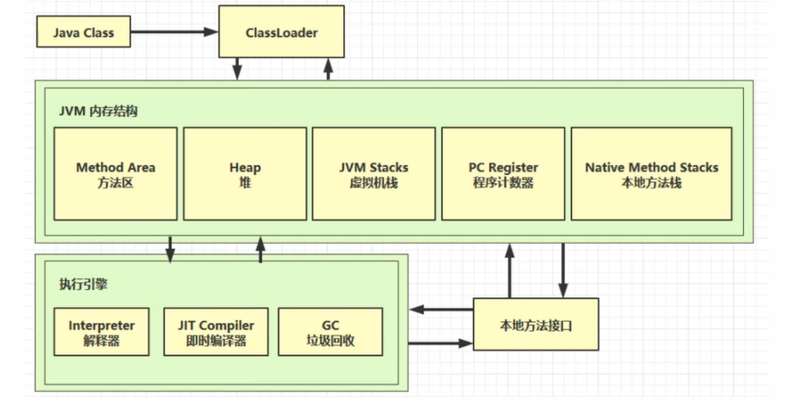
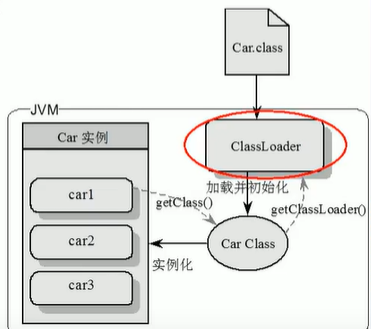
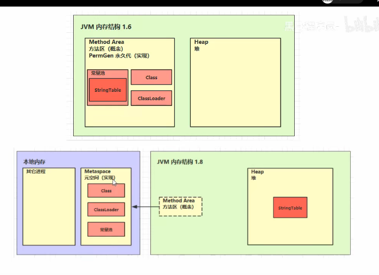

# JVM

### JDK和JRE

JDK=JAVA语言（编译工具）+JVM+JAVA API =JAVA 开发最小环境

JRE= JAVA SE API + JVM 

### JVM体系结构

ClassLoader

虚拟机自带的加载器：

启动类加载器（BootStrap）C++

扩展类加载器（Extension) JAVA

应用程序类加载器 （AppClassLoader) JAVA 也叫系统类加载器，加载当前应用的classpath的所有类

用户可以继承Java.lang.ClassLoader 自定义类加载器

### GC

堆内分区: 伊甸区 幸存区0区 幸存区1区 （前三项统称新生区） 养老区 永久存储区（8后改为元空间）

如果新生的对象无法在 Eden 区创建（Eden 区无法容纳) 就会触发一次Young GC，此时会将 S0 区与Eden 区的对象一起进行可达性分析，找出活跃的对象，将它复制到 S1 区并且将S0区域和 Eden 区的对象给清空，这样那些不可达的对象进行清除，并且将S0 区 和 S1区交换。

新生代的Eden区满了就触发Min GC；新生代（Eden、Survivor）满了就触发Major GC；老年代满了，触发Full GC

对象在伊甸园放不下将会执行一次轻GC，清理幸存区直到能放下对象，如果幸存区清理不出来，任然放不下对象，则会发生重GC，将清理幸存者区并且将幸存区存活下来的对象移到养老区，

如果清理过后幸存区域任然放不下对象，则重GC会将对象直接放在养老区中，如果养老区也不足以放下该对象，则会产生OOM。

### 程序计数器

* 记住下一条JVM指令的执行地址
* 特点
  * 线程私有
  * 不会存在内存溢出的区（唯一）

### 虚拟机栈

* 每个线程运行时所需要的内存 称为虚拟机栈
* 多个栈帧组成，对应每次方法调用时占用的内存（参数、局部变量、返回地址）
* 每个线程只能有一个活动栈帧，对应当前正在执行的方法

> 不需要垃圾回收，每次弹出都自动被回收掉
>
> 栈内存划的大了 最大线程数变少
>
> 如果局部变量没有逃离方法的作用范围，不用考虑线程安全
>
> 如果局部变量引用了对象，并逃离方法的作用范围，需要考虑线程安全

栈帧过多导致栈溢出

### 堆

* 线程共享
* 有垃圾回收机制

### 方法区

* 所有JAVA虚拟机线程共享的区域
* it stroes per-class structure such as **run-time constant pool**, field, method data, the code for methods and constructors, including  the special methods (static) used in class and instance initialization and interface initialization
* 虚拟机启动时创建方法去，逻辑上是堆的组成部分，JDK8以前实现 叫做永久代 就是堆内存的一部分 JDK8以后 用元空间 使用的是操作系统的内存 JDK 8以后 字符串常量池和静态变量 移动到堆中了
* 常量池就是一张表，虚拟机指令根据这张常量表找到要执行的类名、方法名、参数类型、字面量(”abc",1,true这些)等信息，常量池在*.class文件中
* 运行时常量池，常量池是.class文件中的，当类被加载，它的常量池信息就会放入运行时常量池，并把里面的符号地址变成真实地址。
* 

### 工具

jstack 分析线程状态

jps 查看当前系统中有哪些进程

jmap 查看内存占用情况 字符 看的贼麻烦

jconolse 图形界面 监测内存  帧数贼低感觉贼卡

jvisualvm 可以堆快照 找内存对象 很牛逼

javap 反编译

