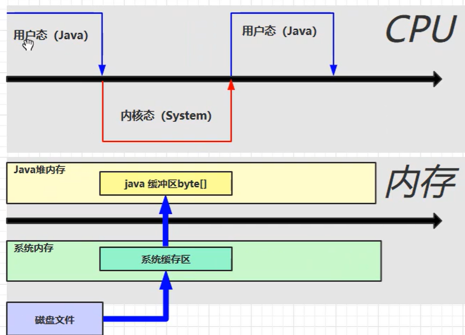
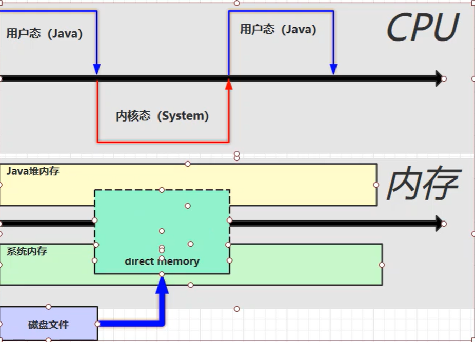
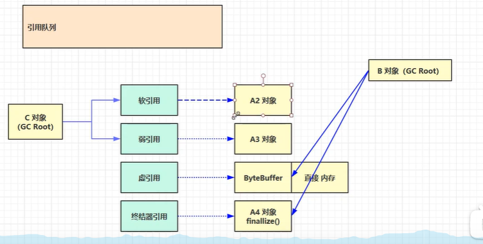
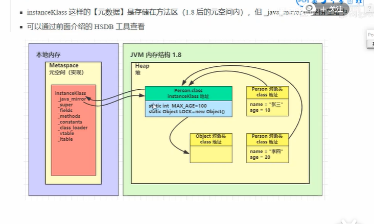
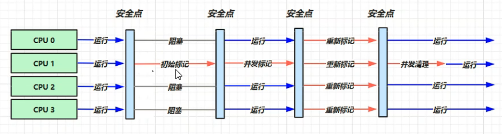
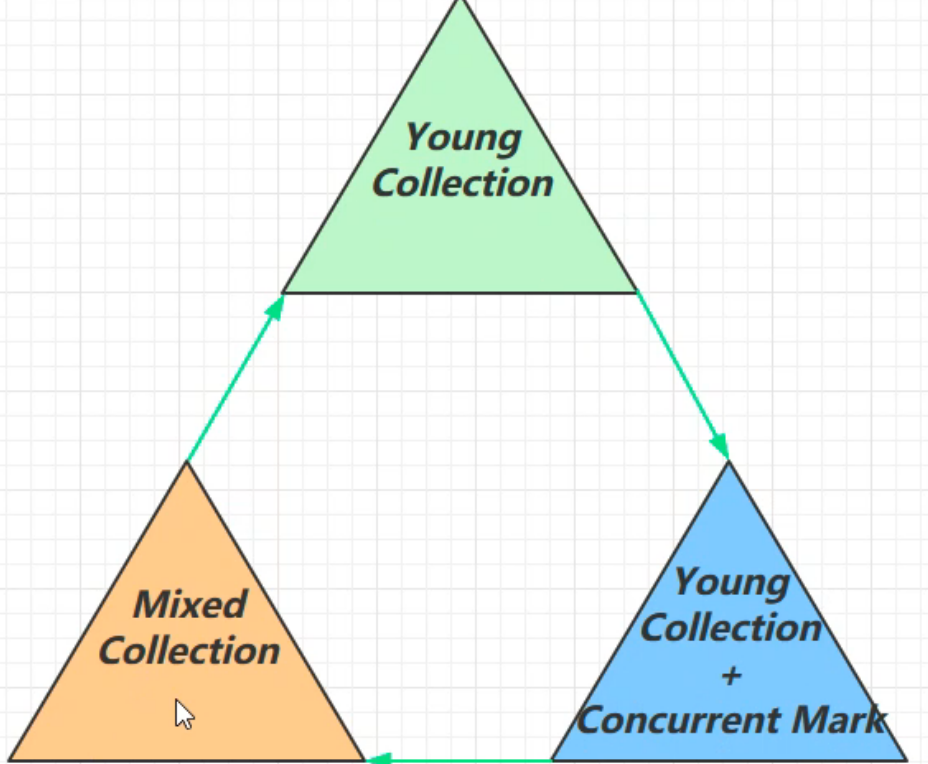

# JVM

### JDK和JRE

JDK=JAVA语言（编译工具）+JVM+JAVA API =JAVA 开发最小环境

JRE= JAVA SE API + JVM 

### JVM体系结构

ClassLoader

虚拟机自带的加载器：

启动类加载器（BootStrap）C++

扩展类加载器（Extension) JAVA

应用程序类加载器 （AppClassLoader) JAVA 也叫系统类加载器，加载当前应用的classpath的所有类

用户可以继承Java.lang.ClassLoader 自定义类加载器

### GC

堆内分区: 伊甸区 幸存区0区 幸存区1区 （前三项统称新生区） 养老区 永久存储区（8后改为元空间）

如果新生的对象无法在 Eden 区创建（Eden 区无法容纳) 就会触发一次Young GC，此时会将 S0 区与Eden 区的对象一起进行可达性分析，找出活跃的对象，将它复制到 S1 区并且将S0区域和 Eden 区的对象给清空，这样那些不可达的对象进行清除，并且将S0 区 和 S1区交换。

Eden区满了就触发Min GC；新生代（Eden、Survivor）满了就触发Major GC；老年代满了，触发Full GC

对象在伊甸园放不下将会执行一次轻GC，清理幸存区直到能放下对象，如果幸存区清理不出来，任然放不下对象，则会发生重GC，将清理幸存者区并且将幸存区存活下来的对象移到养老区，

如果清理过后幸存区域任然放不下对象，则重GC会将对象直接放在养老区中，如果养老区也不足以放下该对象，则会产生OOM。

### 程序计数器

* 记住下一条JVM指令的执行地址
* 特点
  * 线程私有
  * 不会存在内存溢出的区（唯一）

### 虚拟机栈

* 每个线程运行时所需要的内存 称为虚拟机栈
* 多个栈帧组成，对应每次方法调用时占用的内存（参数、局部变量、返回地址）
* 每个线程只能有一个活动栈帧，对应当前正在执行的方法

> 不需要垃圾回收，每次弹出都自动被回收掉
>
> 栈内存划的大了 最大线程数变少
>
> 如果局部变量没有逃离方法的作用范围，不用考虑线程安全
>
> 如果局部变量引用了对象，并逃离方法的作用范围，需要考虑线程安全

栈帧过多导致栈溢出

### 堆

* 线程共享
* 有垃圾回收机制

### 方法区

* 所有JAVA虚拟机线程共享的区域

* it stroes per-class structure such as **run-time constant pool**, field, method data, the code for methods and constructors, including  the special methods (static) used in class and instance initialization and interface initialization

* 虚拟机启动时创建方法区，逻辑上是堆的组成部分，JDK8以前实现 叫做永久代 就是堆内存的一部分 JDK8以后 用元空间 使用的是操作系统的内存 JDK 8以后 字符串常量池和静态变量 移动到堆中了

* 常量池就是一张表，虚拟机指令根据这张常量表找到要执行的类名、方法名、参数类型、静态变量、字面量(”abc",1,true这些)等信息，常量池在*.class文件中 

	> 存放符号引用和字面量 

* 运行时常量池，常量池是.class文件中的，当类被加载，它的常量池信息就会放入运行时常量池，并把里面的符号地址变成真实地址。

* 

### StringTable

* 常量池中的信息，都会被加载到运行时常量池中，但还没有变成Java对象，当运行到那条指令时

	> 常量池中的字符串仅仅是符号，第一次用到时才变成对象

* 利用串池，避免重复创建对象

* 字符串变量拼接StringBuilder

* 字符串常量拼接编译期优化

* 使用Intern方法主动将串池中还没有的字符串对象放入串池

* StringTable本质上在堆中 也会进行垃圾回收

### 直接内存

* 常见于NIO操作中，用于数据缓冲区

* 分配回收成本较高，但读写性能高

* 不受JVM内存管理，会导致内存溢出

* 通过unsafe对象可以完成直接内存的分配和挥手，回收需要主动调用freememory方法，allocateMemory,SetMemory,freememory

* ByteBuffer的实现类内部，使用了Cleaner(虚引用)来检测ByteBuffer对象，一旦ByteBuffer对象被垃圾回收，那就会由ReferenceHandler线程通过Cleaner的clean方法调用freeMemory来释放直接内存

* 传统文件读写 需要再内核态中 先从磁盘读入系统，再从系统缓冲器读入JAVA堆中的缓冲区，再切换到用户态进行读取

	​	*

* 使用直接内存，JAVA可以直接对系统内存的一部分进行操作，不再需要第二次复制

	

	

### 可达性分析

#### GCROOT对象

* System Class 
	* java.lang.*
* Native Stack 本地方法需要用的JAVA对象
* Thread  活动线程中使用的对象 栈帧内的所有对象（局部变量所引用的对象）
* Busy Monitor  被加锁对象

### 四种引用

* 强引用：

	只有所有GC Root对象都不通过【强引用】引用该对象，该对象才能被垃圾回收

* 软引用

	仅有软引用引用该对象，在垃圾回收时，内存仍不足会再次触发垃圾回收，回收软引用

	可以配合引用队列来释放软引用自身

* 弱引用：

	仅有弱引用引用该对象，在垃圾回收时，无论内存是否充足，都会回收弱引用对象 （其实未必，MinorGC的时候如果对象在老年代不会回收，FullGC的时候才回收）

	可以配合引用队列来释放弱引用自身

	

* 虚引用

	必须配合引用队列使用，主要配合ByteBuffer使用，被引用对象回收时，会将需引用入队，由Reference Handler线程调用虚引用相关方法释放直接内存

* 终结器引用

	无需手动编码，内部配合引用队列使用，垃圾回收时，终结器引用入队(被引用对象暂时没有被回收），再由Finalizer线程通过终结器引用找到被引用对象并调用它的finalize方法，第二次GC时才能回收被引用对象

* 

### 回收算法

* 标记清除，速度快但会产生内存碎片
* 标记整理，不会有内存碎片，让内存更紧凑
* 复制，不会有内存碎片，占用双倍内存空间

真正实现垃圾回收时，采用多种方法

### 分代回收

* 对象首先分配在伊甸园区
* 伊甸园空间不足时，触发MinorGC，伊甸园和幸存区from存活的对象使用复制算法复制到幸存区to中，然后存活的对象年龄+1，交换From和to
* minor GC会引发stop the world 发生垃圾回收时会让所有用户线程停止运行，等垃圾回收结束，用户线程才恢复运行
* 当对象寿命超过阈值时，会晋升至老年代最大寿命是15(4bit)
* 当老年代空间不足，会尝试触发MinorGC，如果之后空间仍不足，会触发fullGC,STW时间更长

### 类文件

* 每个字节都规定好该干嘛，对于不定长的（utf8名称、代码），要留两个字节表示你又多少位。
* aload_0 把0号变量压入操作数栈里,如果变量过多就是要aload slot 用占两个字节的命令
* 每个方法都会有一个局部变量表，一般槽0是this
* 如果是调用静态方法用getstatic把静态变量加载近来，再ldc加载参数，再invokevirtual调用方法
* a++ 先执行Load再执行inc ++a 先执行inc在执行Load

### 多态原理

当执行invokevirtual指令时：

1. 先通过栈帧中的对象引用找到堆中的对象
2. 分析对象头（包括8字节markword和8字节的指针），找到对象的实际class
3. class结构中有vtable，它在类加载的链接阶段就已经根据方法的重写规则生成好了
4. 查表得到方法的具体地址
5. 执行方法的字节码

### finally原理

* 会在try catch finally块末尾都加上finally的字节码
* 再return时会先把return的操作数Bipush入栈，再执行finally 字节码 最后执行Ireturn 当然最后的Ireturn可能会被Finally截胡
* finally里带return就不会Athrow抛出

### 泛型擦除

* 泛型编译后都变成了Object
* 但是class文件中依然会存 参数类型星系

### new对象原理

* new #2 在堆中开一快空间，并把地址入操作数栈
* dup 将操作数栈复制一份 一次是调用init方法消耗掉，一次是赋值给对象的引用消耗掉

### sychronized原理

* 先把锁住的对象入操作数栈
* 再dup复制一份
* 然后将其赋值给一个隐藏的局部变量 消耗掉一个
* 然后monitorenter 消耗掉一个
* 然后执行中间代码
* 然后load2 加载这个隐藏的局部变量 将锁对象入操作数栈
* monittorexit消耗掉一个

### 类加载

* 加载
* 链接
	* 验证 class文件
	* 准备 为Static变量分配空间 设置默认值
	  * static变量位于类对象末尾，也就是在堆里
	  * 分配空间和设置默认值是两个过程，分配空间在准备阶段完成，赋值在初始化阶段完成
	  * 如果Static变量是final的基本类型，以及字符串常量，那么编译期间值就确定，赋值在准备阶段完成
	  * 如果Static变量是final的引用类型，那么赋值在初始化阶段完成
	    * 所谓赋值，其实就是调用类的构造方法<clinit>，调用类的构造方法需要在初始化阶段完成，如果编译期间可以确定值，那么就可以进行优化处理，比如常量基本类型，常量字符串，不需要等到初始化阶段
	* 解析  将常量池中的符号引用解析为直接引用
		* 未解析时只是符号引用 比如使用classload进行Load 不会执行解析过程 
		* 解析后运行时常量池里放的时真实的内存地址
* 初始化 通过类变量和静态代码块 指定初始值【懒惰】
	* main方法所在的类，会被首先初始化
	* 访问静态常量不会引起类的初始化 访问静态变量会引起
	* 子类初始化过程中，父类如果还没有初始化 会先进行初始化
* 类加载器
	* 启动类加载器
	* 扩展类加载器
	* 应用类加载器
	* 自定义类加载器

### 运行期优化

对于热点代码 即时编译器JIT（just in time）直接将字节码编译成机器码，不需要解释器进行解释执行，效率提高

解释器翻译的是平台通用的机器码？有平台通用的吗？

JIT根据平台类型，生成平台特定的机器码，更彻底优化更完全

### 垃圾回收器

1. 串行

	* 单线程
	* 堆内存较小场景，单核CPU

2. 吞吐量优先

	* 多线程
	* 堆内存较大场景，多核CPU
	* 让单位时间内，STW时间最短 0.2 0.2 =0.4

3. 响应时间优先

	* 多线程

	* 堆内存较大场景，多核CPU

	* 尽可能让单次STW时间最短 0.1 0.1 0.1 0.1 0.1 =0.5 

	* CMS(ConcMarkSweep 工作在老年代的GC)

		* 初始标记，仅标记GC ROOTS直接关联对象，短暂STW
		* 并发标记，使用GC ROOT TRACEING算法进行跟踪标记，无需STW
		* 重新标记，并发标记过程中产生变动的对象会放入一个队列中供重新标记过程遍历，需要短暂STW
		* 并发清理，不需要STW

		 

		* 缺点：

			吞吐量低: 低停顿时间是以牺牲吞吐量为代价的，导致 CPU 利用率不够高。

			无法处理浮动垃圾，可能出现 Concurrent Mode Failure。浮动垃圾是指并发清除阶段由于用户线程继续运行而产生的垃圾，这部分垃圾只能到下一次 GC 时才能进行回收。由于浮动垃圾的存在，因此需要预留出一部分内存，意味着 CMS 收集不能像其它收集器那样等待老年代快满的时候再回收。如果预留的内存不够存放浮动垃圾，就会出现 Concurrent Mode Failure，这时虚拟机将临时启用 Serial Old 来替代 CMS。

			标记 - 清除算法导致的空间碎片，往往出现老年代空间剩余，但无法找到足够大连续空间来分配当前对象，不得不提前触发一次 Full GC。

### G1垃圾回收器

适合场景

* 同时注重吞吐量和低延时
* 超大堆内存场景（服务器内存），将堆划分为多个大小相等的region
* 整体上是标记整理算法，两个region之间是复制算法

垃圾回收阶段

### GC调优

* 调优领域 

	* 内存
	* 锁竞争
	* CPU占用
	* IO
	* GC ：GC主要影响网络延时，因为会发生STW

* 调优目标

	* 【低延时】（互联网项目） 还是【高吞吐量】（科学运算）
	* CMS G1 ZGC （低延时）
	* ParallelGC （高吞吐量）

* 最快的GC是不发生GC

	* 数据是不是太多？
		* select * 
	* 数据表示是否太臃肿？
		* 对象图
		* 对象大小
	* 是否存在内存泄露
		* static map
		* 软引用、弱引用
		* 第三方缓存实现

* 新生代EDEN

	* TLAB thread-local alloction buffer 减少了线程分配时的并发冲突 伊甸园区为每个线程分配一块私有的空间，所以在伊甸园中创建对象效率非常高
	* 死亡对象回收代价为0
	* 大部分对象用过即死
	* MinorGC 时间远远低于FullGC
	* 新生代越大越好吗？
		* 小了会频繁触发MinorGC
		* 太大了 
			* 老年代空间紧张会触发fullGC 时间花费更长
			* 标记复制算法并不会变慢，因为主要时间花在复制上，复制只有那些很少的剩余的对象，大部分都是被清楚的
			* 新生代理想内存 并发量 *（一次请求-响应所占用的内存)

* 幸存区

	* 幸存区大到能保留【当前活跃的对象+需要晋升的对象】
	* 晋升阈值配置得当，让长时间存活的对象尽快晋升（防止他在幸存区复制来复制去）

* 老年代调优

	* 内存越大越好，避免Concurrent Mode Failure
	* 如果没有Full GC 不需要做老年代调优

* 案例

	* MinorGC和FullGC频繁

		* 新生代空间紧张，业务高峰期，新生代内存塞满，提前晋升，导致老年代空间存在大量生命周期短对象，产生更多FullGC
		* 增大新生代内存，增大晋升阈值

	* 请求高峰期发生FullGC，单次暂停时间特别长（CMS）

		* 主要性能瓶颈出现在CMS重新标记阶段
		* 启动CMSScavengeBeforeRemark，重新标记之前，先对新生代垃圾进行一次清理，减少重新标记的需要

		

### HashMap

* putval()
	* 1.检查table是否初始化
	* 通过hash定位table元素位置 (n-1) & hash  (等价于 hash%n)
	* 分两种情况
		* 不存在hash冲突 直接插入
		* 存在hash冲突 分三种情况
			* 存在key完全相同
			* key不完全相同，且是树节点
			* key不完全相同，链表
	* size超过阈值 resize
* hash()
	* 高16位 低16位异或
		* 保护高16位的特征
		* 异或后0 1 数量平衡 相比 与、或运算

### 工具

jstack 分析线程状态

jps 查看当前系统中有哪些进程

jmap 查看内存占用情况 字符 看的贼麻烦

jconolse 图形界面 监测内存  帧数贼低感觉贼卡

jvisualvm 可以堆快照 找内存对象 很牛逼

javap 反编译

