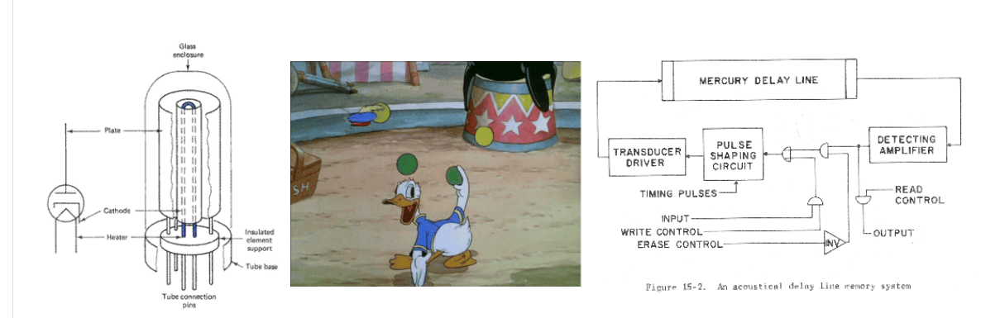
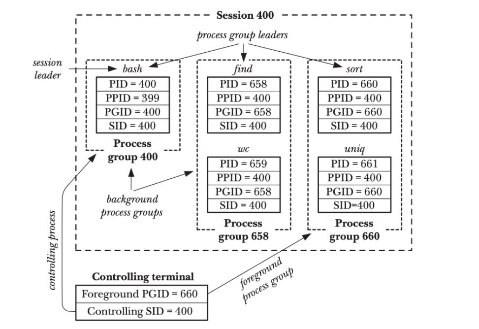

### 操作系统概述

1946 ENIAC 状态机

逻辑门：真空管

存储器：延迟线

输入输出：打孔纸袋 指示灯

### 操作系统上的程序

程序=状态机

* 状态=内存M+寄存器R

### 操作系统状态机模型

程序由操作系统启动，操作系统也是程序，如何启动？

鸡生蛋蛋生鸡

解决方法：软件和硬件 进行约定

* CPU reset 将CPU进入初始状态
  * rip cs ds ...等寄存器恢复初始状态
  * 使得PC 读到一条有效的指令
* PC 初始=ffff0 指向ROM中firmware的一条指令（通常是跳转指令） 
* Firmware:   firmware 就是计算机要运行的第一个软件
  * BIOS Basic IO System 
    * Legacy BIOS
    * 和操作系统握手
    * 把第一个可引导设备（磁盘 SSD 软盘（AB盘所以从C盘开始））的第一个扇区（512字节）MBR 加载到物理内存7c00位置 该程序即bootloader 开始加载操作系统
  * UEFI（Unified Extensible Firmware Interface)
    * Boot loader面临各种硬件：指纹锁、USB上蓝牙转接器连接的蓝牙键盘、不知名厂商生产网卡上的网络驱动
  * 区别
    * BIOS把MBR读出来交给CPU执行，做MBR做想做的事。
    * UEFI是查找磁盘里的\efi\boot\bootx64.efi文件，启动这个可执行程序，让这程序做想做的事。

### 操作系统程序

* 操作系统
  
  * 应用视角：一组对象（进程、文件、设备）+API
  * 硬件视角：一个C程序

* 程序
  
    程序=状态机=计算→syscall→计算
  
  * 被操作系统加载
    * 通过另一个进程执行execve设置初始状态
  * 状态机执行
    * 进程管理 fork execve exit
    * 文件设备管理 open close read write
    * 存储管理 mmap brk
  * 直到_exit（exit_group)退出
  * 源代码S和汇编代码C
    * C=compile(S)

### 什么是正确的编译

C语言层面状态机上  所有不可优化的部分 都被正确地翻译到汇编（状态机）上 除此之外所有的编译器优化都可以做

> 保证观测一致性（sound） 前提下改写代码（rewriting)

### 线程同步

在某个时间点共同达到互相已知的状态

两个人约定好，先结束的要等，等另一方完成他的事情

等我洗个头/打完这句游戏就出门

### 实现同步的方法

任何一个需要同步的大任务都可以分解成多个小任务构成的计算图，就可以用生产者-消费者模型来解决，生产者消费者模型可以通过条件变量和互斥锁来解决。

### 并发编程的真实应用场景

- 高性能计算 (注重任务分解): 生产者-消费者 (MPI/OpenMP)
- 数据中心 (注重系统调用): 线程-协程 (Goroutine)
- 人机交互 (注重易用性): 事件-流图 (Promise)

### 线程、协程

线程切换 需要内核态-用户态切换，由操作系统调度 且每个线程都有对应的内核栈（因为不同的线程可能同时进入系统调用，避免互相影响，每个线程的内核空间是共享的，共享的内核空间为每个线程开辟单独的内核线程栈）

协程切换 类似于函数调用 在用户态完成，由用户程序自己调度  不需要保存寄存器状态 

一个线程多个协程无法利用多处理器

Goroutine通过非阻塞系统调用实现了 多处理器并行+轻量级并发

### 操作系统的完整理解

- CPU Reset → Firmware → Loader → Kernel `_start()` → 执行第一个程序 `/bin/init` （init 可以执行各种系统调用 fork execve exit创建整个世界）→  中断/异常处理程序
- 操作系统：加载第一个 `init` 程序，随后变为 “异常处理程序”
- `init`: fork, execve, exit 和其他系统调用创造整个操作系统世界
- 一个最小的Linux例子

### 系统调用

* fork 保存状态机的所有状态，复制一份，当前进程返回pid，新创建的进程返回0
* execve  重置状态机所有状态，参数包含 执行文件、参数、环境变量（这时候传递的是环境变量） Linux所有的程序执行都是fork+execve 任何程序的第一个系统调用一定是execve
* exit 
	* exit(0) stdlib.h中声明的libc函数  
	* _exit(0) glibc的 Syscall wrapper   退出整个进程 实际上使用exit_group() 系统调用
	* syscall(SYS_exit,0) 仅退出一个线程

### 中断类型

*  interrupt  ： （硬中断） asynchronous 
* exception ：（软中断）除0 非法地址 不可屏蔽
* trap :（软中断）synchronous   系统调用 int 80 
* 由操作系统装载中断处理程序（中断向量表）

### terminal   vs. shell

A terminal is a text input and output environment.

Shell stands for the command-line interpreter. 

A terminal is a program that allows you to run a shell.

### session process group

### Shell

shell = fork + execve + pipe

解析命令树 fork一份 execve执行 

遇到pipe 调整fork出的两份进程的描述符

### Copy On Write

fork后并不复制所有内存，而是把虚拟地址空间复制，虚拟地址指向的页面成为共享页面，OS持有引用计数，对共享页面写时触发COW，复制一份新的页面

###  ELF可执行文件

可执行文件=状态机初始状态的描述+迁移的数据结构

### 源代码 --- 可执行文件

* GCC  High-level semantics (C 状态机) → low-level semantics (汇编）
	* 把 C代码状态机 翻译 成内存+指令状态机+返回映射（调试）
* AS: Low-level semantics → Binary semantics (状态机容器)
	* as 翻译成 二进制数据结构+约束条件 描述了上述所有
	* “一一对应” 地翻译成二进制代码 section symbols debug info
	* 不能决定的要留下 “之后怎么办” 的信息  relocations

* ld: 合并所有容器，得到 “一个完整的状态机”
	* ld 把.o文件中所有的约束条件都满足
	* ldscript (`-Wl,--verbose`); 和 C Runtime Objects (CRT) 链接
	* missing/duplicate symbol 会出错

### 处理器调度

* Round-Robin
* MLFQ
	* 让出时间片就提高你的优先级
	* 用完时间片就降低你的优先级
	* 交互式程序能够获得更高的优先级
	* 定期把所有人优先级拉平 避免While（1）饥饿
* CFS

### CFS完全公平调度

vruntime 实现 nice调整虚拟调度时间

1. fork()出来的子进程
	* 子进程先执行 会有切换开销
	* 父进程先执行 会有copy on write的问题 因为子进程可能直接execve
2. 唤醒的进程是否要补齐vruntime
3. vruntime无限增长

### 实时OS 优先级翻转 
