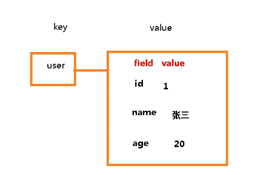
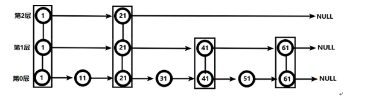
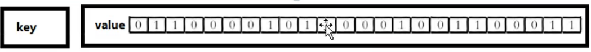
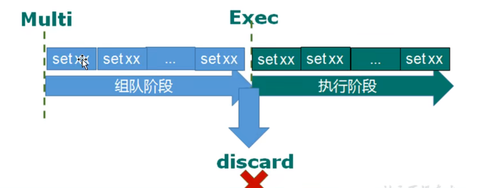
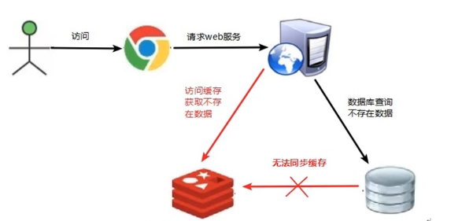
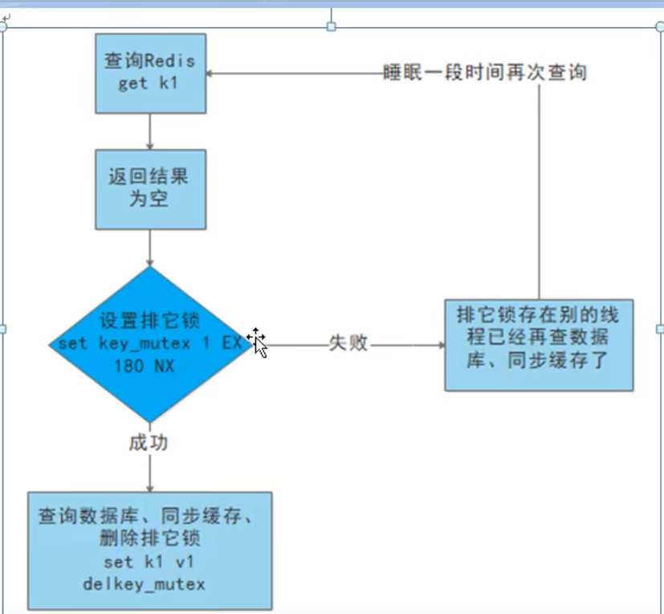
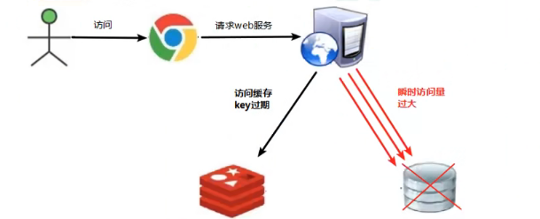
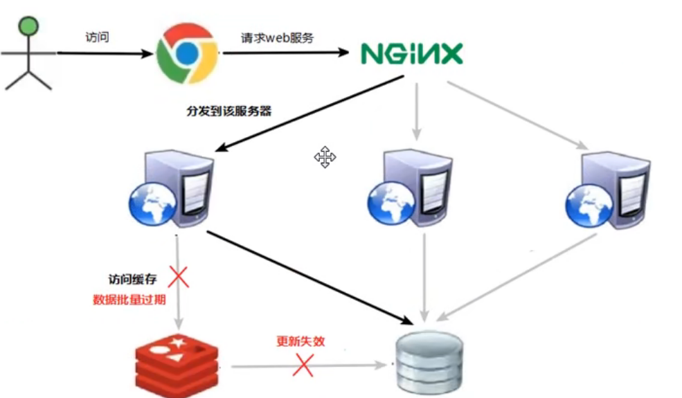

# Nosql

### 为什么使用nosql

1. 数据量的大小一个机器放不下
2. B+树索引内存放不下
3. 读写混合访问量一个机器不能承受

### 架构演变

1. APP-DAL-MYSQL

2. APP-DAL-CACHE- n* MYSQL(垂直拆分)

3. mysql主从读写分离 APP-DAL-CACHE-n*MYSQL(主库）-slave(从库)

4. 分库分表+水平拆分+Mysql集群 （主库写压力开始出现瓶颈）

   > 分库：热点数据放在一些库上，变化少、冷数据(账号密码）放在另外一些库上
   >
   > 分表：100W数据存不到一张表里，1~30W存一个表 30~60存一个表 60~90存一个表
   >
   > 

5. 视频图片咋能丢Mysq里呢

redis=KV+cache+Persistence

### Nosql的一个应用

* session对象如何在多个数据库中存储？
  * 存储到客户端 cookie里 安全性不行
  * Session复制 数据冗余
  * nosql数据库 = 多个服务器的全局变量

### NOSQL适合的场景

* 对数据高并发读写
* 海量数据读写
* 对数据高扩展性 （alter table add column)

### 不适合场景

* 事务支持
* sql结构化查询，处理复杂关系
* 用不着sql和用了sql也不行的情况，考虑nosql

# Redis

### memcache区别

redis 支持多数据类型，支持持久化，单线程+IO多路复用

memcache 多线程+锁

### 事件驱动——IO多路复用

## 字符串

### 原子操作

redis中的原子操作指不会被线程机制打断的操作，在单线程中，能够在单挑指令中完成的操作都可以被认为是原子操作，Redis单命令的原子性主要得益于Redis的单线程

### 数据结构

简单动态字符串（simple dynamic string SDS) 类似于ArrayList实现，采用预分配冗余空间方式来减少内存的频繁分配 小于1M时每次加倍扩容，大于1M时每次扩容1M

## 列表

底层双向链表，值在键在，值光键亡

列表元素较少的情况下会使用连续内存存储，结构是ziplist，压缩列表，所有元素紧挨着一起存储，当数据量较多的时候才会改成由多个ziplist构成的quicklist

多个ziplist构成一个quicklist  避免了每个结点都需要prev和next指针，减少空间浪费

## 集合

和JAVA的HashSet内部实现利用到HashMap一样，所有value都指向一个dummy对象，redis的Set内部也是Hash结构，所有value指向同一个内部值

## Hash哈希

String类型的field 和 value映射表，特别适合用于存储对象，类似于JAVA的Map<String,Object>

对应两种数据结构：

filed-value长度短个数少时使用ziplist，否则使用Hashtable

## Zset有序集合

类似于JAVA的Map(String,Double),又类似于Tree Set

（1）hash 关联元素value和score，保证value唯一的同时可以找到对应Score

（2）跳跃表，给value排序，根据score范围获取元素列表，跳跃表效率堪比红黑树，且实现简单

应用场景：统计排名

## 新数据类型

* Bitmaps
  * 
  * 统计用户是否访问,用户量大时节约空间

* HyperLogLog

  * 统计网站PV（PageView页面访问量），可以使用Redis的incr\incrby轻松实现，应用场景：UV（UniqueVistor）、独立IP数、搜索记录数等需要去重和技术的问题如何解决，求不重复元素个位数的问题称为基数问题

  * 基数问题解决方案：

    * 数据存储在MYSQL表中，使用disinct count计算不重复个数
    * 使用Redis提供的hash,set,bitmaps等数据结构来处理

    以上翻案结果精确，但随着数据量不断增加，导致占用空间越来越大，不合实际

    能否通过降低一定的精度来平衡存储空间，Redis提出了HyperLogLog来做基数统计算法，优点是在输入元素的数量体积非常大的时，计算基数所需的空间是固定的，只需要花费12KB内存，就可以计算接近2^64个不同元素的基数

* Geospatial 经纬度坐标

## Redis事务

Redis事务是一个单独的隔离操作，事务中的所有命令都会序列化、按顺序地执行，事务在执行的过程中，不会被其他客户端发送来的命令请求打断。

Redis事务的主要作用就是串行多个命令防止别的命令插队

 

* 组队过程有任何一命令失败，执行过程所有命令都不执行
* 组队过程没问题，执行过程失败无所谓，继续执行吓一条命令，说白了没原子性
* 类比编译时异常和运行时异常的概念

### Redis事务三个特性

* 单独的隔离操作
  * 事务中的所有命令都会被序列化顺序地执行，事务在执行的过程中，不会被其他客户端发来的命令请求所打断
* 没有隔离级别的概念
  * 队列中的命令没有提交之前都不会被实际执行
* 不保证原子性
  * 事务中如果有一条命令执行失败，其后的命令仍然会被执行，没有回滚 

### 秒杀案例

* 超卖问题
  * 通过watch+事务解决
* 连接超时问题 用连接池解决
* 库存遗留问题
  * 用乐观锁导致的，500个商品，500个并发，由于watch冲突，部分请求无法完成，所以库存超过0个
  * 解决方法：通过Lua脚本将减库存插用户两个操作合并为一个原子操作，Lua脚本有一定原子性

### Redis持久化

* RDB (Redis DataBase)
  * 在指定时间间隔内将内存中的数据集快照写入磁盘
  * RDB是如何执行的
    * Redis会单独Fork一个进程来进行持久化，先将数据写入到一个临时文件中，待持久化都结束了，再用这个临时文件替换上次持久化好的文件。
    * Fork出来的子进程会执行exec系统调用，出于性能考虑，Linux引入了【写时复制技术】，fork出来的子进程并不会创建一个父内存用户空间的一个副本来
  * 特点
    * 适合大规模数据恢复
    * 对数据完整性和一致性要求不高可以使用
    * 节省磁盘空间
    * 恢复速度快
  * 缺点
    * 间隔一定时间做一次备份，如果间隔时间内意外down掉丢失最后一次快照之后的所有修改
    * 如果数据量很大，同步时可能会影响redis工作
* AOF(Append Only File)
  * 以日志形式记录写操作，不记录读操作，将所有写指令记录下来，只许追加文件，不许改写文件
  * 同步频率，根据appendfsync设置
    * appendfsync always 每次写入都会立刻计入日志;性能较差，数据完整性较好
    * appendfsync everysec每秒同步，每秒记录日志一次 最多只会丢失1S
    * appendfsync no 从不主动进行同步，将同步时机交给操作系统
  * Rewrite压缩重写操作
    * 压缩操作原理：把RDB快照以二进制形式附在新的aof头部，作为已有的历史数据，替换掉原来的流水账操作、
    * 默认文件大于64M的100%时触发，即128 M
  * 整体流程
    * 写命令追加入AOF缓冲区
    * 根据同步策略同步到磁盘
    * 文件大小超过限制时会触发压缩重写
  * 优势
    * 同步频繁，更好地保护数据
    * 追加命令至文件末尾，写入性能高
    * 日志文件易读，适合做灾难性的误删除紧急恢复，把最后AOF文件的flushall命令删除，前提是没执行过rewrite
  * 缺点
    * AOF文件比RDB数据快照要大
    * aof写入比较频繁，性能消耗大
    * 数据恢复比较慢

### RDB AOF用哪个好？

官方推荐俩都开着，对数据不敏感，可以单独用RDB，不建议单独用AOF，如果只做纯内存缓存，可以都不用

俩都开着默认使用AOF，但做RDB和AOF持久化并不冲突，可以使用RDB做容灾备份，甚至可以直接将RDB文件命名为AOF做文件恢复

## 主从复制

### 一主多从的好处

* 读写分离
* 容灾快速恢复，一台从坏掉，切换到另一台从

### 常用三招

* 一主二仆

  * 你大哥永远是你大哥，小弟挂了小弟重启后，重新从大哥那下数据

* 薪火相传

  ​	一个Slave可以是另一个slave的slave,有效减轻master的压力，去中心化降低风险

* 反客为主

  ​     slaveof no one将从机变成主机，但是需要手动输入命令，因此需要哨兵模式

### 主从复制原理

1. 从服务器连接上主服务器后，发送数据同步请求
2. 主服务器街到同步请求后，把主服务器数据进行持久化，rdb文件，把rdb文件发送给从服务器，从服务器拿到rdb进行读取
3. 每次主服务器写操作后，会和从服务器进行数据的同步，从服务器只在第一次连接时请求，之后每次都是主服务器发起的数据同步
   * 全量复制：slave接受到rdb后，将其存盘并加载到内存
   * 增量复制：新的修改命令传给slave，完成同步

### 哨兵模式

反客为主的自动版，能够后台监控主机是否故障，如果故障了根据投票数自动将从库装换为主库

复制延时问题：

每次写在主机操作，然后同步到从机，有一定延迟，从机越多延迟越严重

选择皇帝的顺序：优先级，偏移量（和主机的同步情况），runid（启动时随机生成的id)

## Redis集群

容量不够，redis如何扩容？ 多台redis

并发写操作，redis如何分摊？ 集群分担写压力

无中心化集群配置：不需要代理对进行消息转发，集群中的每台master都可以作为代理

Redis集群实现了对Redis的水平扩容，即N个redis节点，将整个数据分布存储在N个节点中，每个节点存储数据的1/N

Redis集群通过分区（partition）来提供一定程度的可用性（availability)：即使集群中有一部分节点失效或者无法通讯，集群也可以继续处理命令请求

一个Redis集群包含16384个插槽（hash slot),数据库中的每个键都属于这16384个插槽中的一个

集群使用公式CRC16(key) % 16384来计算key属于哪个槽

集群中的每个节点负责处理一部分插槽

### 故障恢复

主机挂掉，从机当老大，原主机恢复后，一朝天子一朝臣

主从都挂掉后，根据集群配置决定，要么整个集群都挂掉，要么某段数据不能被访问

### 优点

* 实现扩容
* 分摊压力
* 无中心化，配置简单

### 缺点

* 多键操作不支持
* 多建的Redis事务不被支持，lua脚本不被支持
* redis集群出现较晚，采用其他的集群方案，迁移复杂度大

## 应用问题

### 缓存穿透

> 用户请求在缓存中不存在，在数据库中也不存在

现象：

1. 应用服务器压力增大
2. redis命中率降低
3. 一直查询数据库

redis一直平稳运行，但是缓存不命中

问题原因：

* redis查询不到数据库
* 出现很多非正常url访问（遭受攻击，故意一直查你数据库）

解决方案：

* 对空值做缓存：key-null，设置空结果过期时间短一点
* 设置白名单：bitmaps里定义可访问名单，id作为Bitmaps的便宜来那个，每次访问进行比较，如果id不在bitmaps里，你行拦截，不允许访问
* 布隆过滤器：类似于对bitmap进行了优化，但是有时候可能命中不到
* 进行实时监控，排查访问对象和访问数据，和运维人员配合，设置黑名单限制服务

### 缓存击穿

> 一个key非常热点，不停的扛着大并发，当这个key失效的瞬间，持续的大并发就会穿破缓存，直达数据库，好像在屏障上开了一个洞

现象

1. 数据库访问压力瞬间增加
2. redis里面没有出现大量key过期
3. redis正常运行

问题原因：

1. redis某一个Key过期，大量访问使用这个key

解决方案：

* 预先设置热门数据：把数据的Key时长增加

* 实时调整：监控哪些数据热门，调整key过期时长

* 使用锁：效率低

  

### 缓存雪崩

> 不同的数据大批量到期，而查询数据量巨大，请求直接落到数据库上导致宕机

现象：

1. 数据库压力变大服务器崩溃

问题原因：

1. 在极少时间段，查询大量key的集中过期情况

解决方案：

* 构建多级缓存架构
* 使用锁或者队列：不适合高并发
* 设置过期标志更新缓存：记录缓存数据是否过期，设置提前量，如果过期会触发通知另外的线程在后台去更新实际key的缓存
* 将缓存失效时间分散开：给失效时间加一个随机值

### Redis删除策略

* 定时过期

  为每个key创建一个定时器，过期立即清除，对内存友好，但CPU要去检查和处理过期数据

* 惰性过期：当访问一个key时，才会判断是否过期，过期则清楚。节省CPU资源，对内存不友好，极端情况下大量过期key没有被访问

* 定期过期：每隔一定时间，扫描一定数量的数据库过期字典中的一定数量的Key,清除其中已经过期的key，通过调整时间间隔，达到cpu和内存资源的折衷

### Redis内存满

* 返回错误不淘汰key
* 所有键使用lru/lfu进行淘汰
* 过期键使用Lru/lfu进行淘汰
* 随机删除
* 随机删除过期键
* 删除快过期的键

### 分布式锁

分布式集群系统进程、线程被分布在不同的机器上，原来单机部署情况下的并发控制策略失效，JAVA API不能提供分布式锁的能力，为解决这个问题，需要一种跨JVM的互斥机制来控制对共享资源的访问，这就是分布式锁解决的问题

* 基于数据库实现分布式锁
* 基于redis 性能最高
  * 使用setnx上锁 del释放锁
  * 设置锁的过期时间，自动释放
    * 加锁+过期时间 非原子操作：合成一个原子操作命令
    * 抢到锁之后卡到过期，锁释放了但是节点依然会运行咋办，既会有数据不一致问题，原节点还可能再次释放锁，通过uuid
    * 删除操作非原子性，即使用了uuid，也有可能把别人占用的锁删掉，通过Lua脚本保证原子性
* 基于zookeeper 可靠性最高

为了确保分布式锁可用，需要满足以下四个条件：

1. 互斥性，任何时刻只有一个客户端可以持有锁
2. 不会发生死锁
3. 解铃还须系铃人
4. 加锁和解锁必须有原子性

### REDIS多线程

执行命令依然是单线程，因为这往往不是主要的性能瓶颈，网络IO和客户端采用多线程

### Redis部署方式

* 普通单机
* 主从，读写分离
* 哨兵，防止节点挂掉
* 集群，数据分片

### 哨兵的作用

* 监控主从数据库
* 当主数据库挂掉，选举一个从数据库

### cluster故障恢复

每个节点会定期向其他节点发送Ping命令（心跳检测机制），如果长时间没有回复，就认为疑似下线，

### 无硬盘复制

主从同步过程中都要生成RDB快照，影响性能。

直接通过网络IO来做。

