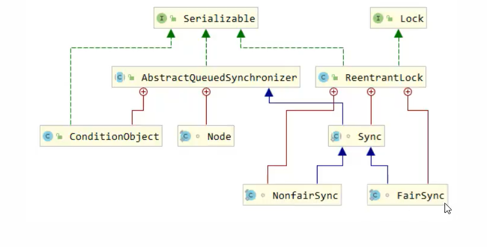
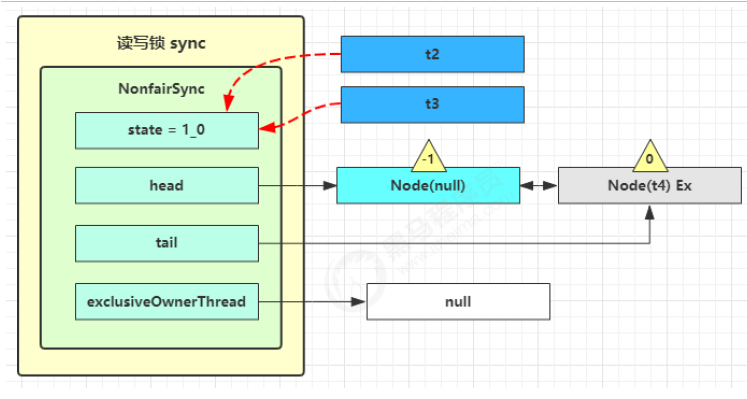
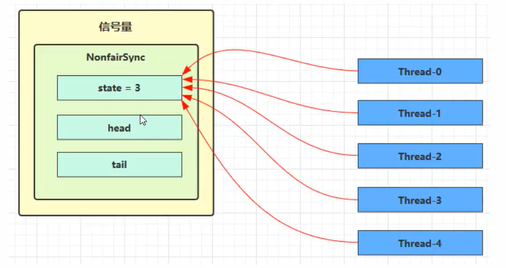

# 多线程

# 基础语法

### 进程和线程

* 进程是一个程序的实例，当程序从磁盘被加载到内存中，就开启了一个进程
* 一个进程可以拥有多个线程，线程之间共享资源，进程是线程的容器
* 线程是调度的基本单位，进程是资源分配的基本单位
* 进程之间通信较为复杂，线程通信相对简单，因为共享内存
* 线程更轻量，其上下文切换成本更低

### 并发和并行

GO语言之父Rob Pike　

* 并发是同一时间应对（deal with）多件事情的能力。
* 并行是统一时间动手做（doing）多件事情的能力。

### 同步和异步

需要等待结果返回才能继续运行，就是同步

不需要等待结果返回，就能继续运行，就是异步

### 线程

java线程调用start之后，究竟是否start后被不被执行，取决于操作系统调度

调用 Thread.sleep 会让当前线程从 Running 进入 Timed Waiting 状态（阻塞）

调用 Thread.yield 会让当前线程从 Running 进入 Runnable 就绪状态，然后调度执行其它线程,当然哪个具体哪个线程执行取决于操作系统调度器

调用 t.join 等待线程结束

#### Interrupt

打断阻塞线程 会重置打断标记IsInterrupted 即=false     ,打断正在运行线程则会设置=true

#### 守护线程

默认情况下，Java 进程需要等待所有线程都运行结束，才会结束。有一种特殊的线程叫做守护线程，只要其它非守护线程运行结束了，即使守护线程的代码没有执行完，也会强制结束。

* 垃圾回收器就是守护线程

### 线程状态

操作系统线程状态：初始，运行，阻塞，就绪，终止

JAVA中操作系统状态 ：

* NEW 线程刚被创建，但是还没有调用 start() 方法
* RUNNABLE 当调用了 start() 方法之后，注意，Java API 层面的 RUNNABLE 状态涵盖了 操作系统 层面的
  【就绪状态】、【运行状态】和【阻塞状态】（由于 BIO 导致的线程阻塞，在 Java 里无法区分，仍然认为
  是可运行）
* BLOCKED ， WAITING ， TIMED_WAITING 都是 Java API 层面对【阻塞状态】的细分，后面会在状态转换一节
  详述
* TERMINATED 当线程代码运行结束

本章的重点在于掌握

* 线程重要 api，如 start，run，sleep，join，interrupt 等
* 异步调用：主线程执行期间，其它线程异步执行耗时操作
* 提高效率：并行计算，缩短运算时间
* 同步等待：join
* 线程运行流程：栈、栈帧、上下文切换、程序计数器
* Thread 两种创建方式 的源码

### 临界区

* 一个程序运行多个线程本身是没有问题的 问题出在多个线程访问共享资源
* 多个线程读共享资源其实也没有问题
* 在多个线程对共享资源读写操作时发生指令交错，就会出现问题
* 一段代码块内如果存在对共享资源的多线程读写操作，称这段代码块为临界区
* 多个线程在临界区内执行，由于代码的执行序列不同而导致结果无法预测，称之为发生了**竞态条件**

### 设计原则

**开闭原则中的闭合原则，不想往外暴露的，就设置成final，增加类的	性**

> String 如果不设计成Final ，那么其子类可能覆盖掉String类中的一些行为，导致线程不安全的发生

# synchronized 

* 锁在方法上 等于锁this对象，锁在静态方法上，等于锁class对象

### 线程安全类

* String

* Integer

* StringBuffer

* Random

* java.util.concurrent 包下的类

  这里说它们是线程安全的是指，多个线程调用它们同一个实例的某个方法时，是线程安全的。

### 怎么样会引发线程不安全？

对共享变量有读写操作

### 对象头 ，锁到底在哪里？

对象=对象头+实例对象+填充

对象头=Mark word + Class word（类对象）

Mark word 里包含 hashcode、age、各种锁和加锁状态

### Monitor（监视器/管程）

对象=Mark Word+ class word(指向方法区的指针）+object body

普通对象


数组对象


Mark Word结构


### 轻量级锁 

一个对象的多线程访问时间是错开的，那么可以使用轻量级锁来优化

>栈帧里维护一个lock record（锁记录=锁记录地址+00  和 对象地址）,使用CAS机制将锁记录地址与对象头互换  
>
>CAS失败：
>
>如果发现lock record是当前线程 执行锁重入
>
>否则【锁膨胀】 升级重量级锁  对象头变为Monitor指针 owner指向被占用的线程 当前线程进入entryList

###  重量级锁竞争：锁自旋

当对象头Markword是重量级锁指针时，进行几轮空转

### 偏向锁

【偏向锁】使用偏向锁在同一线程访问时就不必再进行CAS

【撤销】:

1. 对象调用了hashcode

2. 当有其他线程使用偏向锁的时候，会将偏向锁升级为轻量锁，并且释放后锁状态改为不可偏向锁。
3. 调用wait notify ，因为只有重量级锁才能实现

【批量重偏向】：

当撤销偏向锁过多超过20次，JVM就不信任原来的线程，因此整个类的所有对象就可以进行重偏向，可以对锁进行重偏向

【批量撤销】

如果撤销超过40次，jvm会觉得就TM不该偏向，于是整个类的所有对象都会变为不可偏向，新建的对象也是不可偏向

【锁消除】

JIT即使编译器，对JAVA字节码进行进一步优化，发现局部变量不会逃离方法的作用范围，即局部变量不可能被共享，将会优化对局部变量的加锁代码。

### wait() 和 notify()


* owner发现条件不满足，调用wait，进入WaitSet，变为WAITING状态
* BLOCKED 的线程 是获得不了锁 在等待锁，WAITING线程是 获得了锁，又主动释放掉了，进入等待，他们都不会占用CPU时间
* notify唤醒waiting线程后会重新进入entryList竞争

### sleep 和 wait 的区别

* sleep是Thread类的方法，wait是Object的方法
* sleep不需要获得对象锁，wait需要获得对象锁
* sleep不会释放锁，wait会释放锁
* sleep(long) wait(long)后线程状态都是TIMED_WAITING  wait()后线程状态是WAITING
* wait() 与join()的区别: join是一个线程等待另一个线程的结束 但join的实现其实用的也是wait

### 同步模式： 保护性暂停模式

一个JAVA线程需要等待另一个JAVA线程的运行结果，即Guarded Suspension

异步模式: 生产者消费者模式

### park和Notify的区别

* wait notify  必须配合Monitor使用，而park Unpark不必

* park和unpark以线程为单位唤醒，notify随机

  park原理，每个线程都有一个 Parker对象，由三部分组成_mutex, _cond , _counter(备用干粮)


### 线程之间的状态转换


1. 调用start()
2. t线程用synchronized(obj) 获取对象锁后
   * 调用obj.wait()方法 ：runnable->waitting
   * 其他线程调用obj.notify() obj.notify() t.interrupt()后 waiting->blocked 从 waitSet 进入 EntryList
3. 当前线程调用t.join()方法 当前线程从runnable 到waiting
4. LockSupport.park() LockSupport.unpark(t)

### 活锁

一个进程想加到100 一个进程减道0  俩特么怼到天亮永远也停不了

### 饥饿

一个线程由于优先级太低，永远得不到CPU调度执行

### 死锁的四个必要条件

* 互斥条件：一个资源只能被一个进程占用
* 请求和保持条件：一个资源请求资源而阻塞时， 对已经获得的资源不释放
* 不可剥夺条件：进程已经获得的资源不会被其他进程剥夺
* 循环等待条件：若干进程形成了一种首尾相接的资源等待关系

### ReentrantLock

* 可打断：等待锁.lockInterruptibly()时可以被Interrupted 属于被动解决死锁
* 可以设置超时时间：主动解决死锁 
* 可以设置公平锁：先进先出，防止饥饿，实际没有必要，trylock() 就好，公平锁会降低并发度
* 支持多个条件变量 condition.await() condition.singal() 而synchronized锁的对象只能调一个wait() 

### 知识回顾

* 互斥 使用Synchronized  或 Lock 达到共享资源互斥效果
* 同步 使用wait/notify 或 condition. await/signal 或 LockSupport.park unpark达到 线程间通信的效果

* wait notify 对标的是锁对象

* await signal 对标的是ReentrantLock的条件变量Condition

* park unpark 对标的是线程
* monitor原理(waitSet EntryList Owner) 又JVM里的C++源码实现 ReentrantLock在JAVA级别实现了Monitor
* synchrnized原理（对象头、CAS、偏向锁、轻量级锁、重量级锁、锁膨胀、锁撤销、锁自旋、锁消除）
* wait/notify 原理 （waitSet等待)
* park unpark原理（_cond _mutx _counter)
* 同步模式 保护性暂停模式（线程1想获得线程2执行后的结果）
* 异步模式 生产者消费者
* 同步模式 顺序控制 三个线程输出abcabcabc

# volatile

java内存模型JMM，从JAVA层面定义了**主存（共享数据）、工作内存（线程私有数据）**的概念，看似就两个东西，但是底层对应着CPU寄存器、缓存、硬件内存、CPU指令优化等一大堆无法兼顾的问题，主要让JAVA程序员不用考虑复杂的内存管理

JMM体现在以下几个方面：

* 原子性-保证指令不会受到线程上下文切换的影响 synchronized  
* 可见性-保证指令不会受到CPU缓存的影响 
  *  推荐：volatile 避免线程从工作缓存中查找变量的值，必须到主存中去操作，通常用在多个线程读，一个线程写的情况中
  * synchronized 也能实现，JMM规定，线程在加锁时， 先清空工作内存→在主内存中拷贝最新变量的副本到工作内存 →执行完代码→将更改后的共享变量的值刷新到主内存中→释放互斥锁。
* 有序性-保证指令不会受到CPU指令并行优化的影响 加volatile 禁止之前代码重排序

### 指令重排序


每条指令执行过程分为：

* 取指令   instruction fetch IF
* 指令译码 instruction decode ID
* 执行指令 execute EX
* 内存访问 memory access MEM
* 数据写回 register write back WB

现代CPU支持多指令级流水线，能够并行执行指令五个过程的称为五级指令流水线

 为了减少指令并行化导致的阻塞，JIT（Just-In-Time） J即时编译器会进行指令重排序提高吞吐量

### volatile原理

底层实现原理是内存屏障 Memory Barrier (Memory Fence)

* 对volatile的写指令会加入写屏障
* 对volatile的**读指令前**会加入读屏障

写屏障（sfence）：

* 该屏障之前，所有对共享变量的改动，都同步到主存当中。 
* 不会对写屏障之前的代码进行指令重排

读屏障（lfence) : 保证该屏障之后，对共享变量的读取，加载的是主存中的最新数据

读写屏障不能保证原子性，只能保证有序性（禁止重排）和可见性（读主存）

```java
public void actor2(I_Result r){
    num=2;
    ready=true;
    //写屏障   之前数据全部写入主存  之前的代码不允许指令重排
}
public void actor2(I_Result r){
    //读屏障 之后的数据全部从主存中读 之后的代码不允许指令重拍
    if(ready){
        r.r1=num+num;
    }
    else{
        r.r1=1;
    }
}
```

### dcl double check lock问题

new Singleton();过程分为四步

```
17: new #3 // 堆上创建对象 引用入栈
20: dup // 获得引用
21: invokespecial #4 // 调用构造方法
24: putstatic #2 // 引用复制给静态变量
```

synchronized 里面的代码会发生指令重排序 可能会先执行24 再执行21，当24和21期间其他线程有可能会访问，即会反回一个未调用构造方法的静态变量	

```java
public final class Singleton {
    private Singleton() { }
    private static volatile Singleton INSTANCE = null;
    public static Singleton getInstance() {
    // 实例没创建，才会进入内部的 synchronized代码块
        if (INSTANCE == null) {
            synchronized (Singleton.class) { // t2
        // 也许有其它线程已经创建实例，所以再判断一次
                if (INSTANCE == null) { // t1
                    INSTANCE = new Singleton();
                }
            }
        }
        return INSTANCE;
    }
}
```

### 单例模式问题

```java
// 问题1：为什么加 final : 防止子类覆盖方法破坏单例
// 问题2：如果实现了序列化接口, 还要做什么来防止反序列化破坏单例： 增加readResolve()方法 反序列化过程中一旦发现readResolve会将该方法返回的对象作为返回对象 而不是把反序列化字节码生成的对象当成反序列化结果
public final class Singleton implements Serializable {
// 问题3：为什么设置为私有? 是否能防止反射创建新的实例? ：别的类就能无限创建对象了，不能防止
    private Singleton() {}
    // 问题4：这样初始化是否能保证单例对象创建时的线程安全? : 静态成员变量的初始化操作在类加载阶段完成，JVM保证线程安全性
    private static final Singleton INSTANCE = new Singleton();
    // 问题5：为什么提供静态方法而不是直接将 INSTANCE 设置为 public, 说出你知道的理由：
    //  可以实现懒汉式，当前是饿汉式
    //  对创建的单例对象有更多的控制
    //  提供泛型支持
    public static Singleton getInstance() {
        return INSTANCE;
    }
    public Object readResolve() {
    	return INSTANCE;
    }
}
```

```java
// 问题1：枚举单例是如何限制实例个数的  ：枚举类的实例实际上就是这个类的静态成员变量
// 问题2：枚举单例在创建时是否有并发问题 ： 没有 静态成员变量
// 问题3：枚举单例能否被反射破坏单例： 不能，枚举类型不能通过new Instance创建
// 问题4：枚举单例能否被反序列化破坏单例：  不会被破坏
// 问题5：枚举单例属于懒汉式还是饿汉式： 饿汉
// 问题6：枚举单例如果希望加入一些单例创建时的初始化逻辑该如何做 ： 写构造方法
enum Singleton {
	INSTANCE;
}
```

```java
public final class Singleton {
    private Singleton() { }
    private static Singleton INSTANCE = null;
    // 分析这里的线程安全, 并说明有什么缺点: 性能比较差 每次都得枷锁
    public static synchronized Singleton getInstance() {
        if( INSTANCE != null ){
            return INSTANCE;
        }
        INSTANCE = new Singleton();
        return INSTANCE;
    }
}
```

```java
//DCL实现
public final class Singleton {
    private Singleton() { }
    // 问题1：解释为什么要加 volatile ? ：指令重排序
    private static volatile Singleton INSTANCE = null;
    // 问题2：对比实现3, 说出这样做的意义 ： 提高效率减少加锁次数
    public static Singleton getInstance() {
    	if (INSTANCE != null) {
    		return INSTANCE;
    	}
        synchronized (Singleton.class) {
        // 问题3：为什么还要在这里加为空判断, 之前不是判断过了吗 ：线程原子性
            if (INSTANCE != null) { // t2
                return INSTANCE;
            }
            INSTANCE = new Singleton();
            return INSTANCE;
        }
    }
}
```

```java
public final class Singleton {
    private Singleton() { }
    // 问题1：属于懒汉式还是饿汉式:懒汉 类加载本身是懒惰 类只有第一次被用到时才会出发类加载操作 真的懒 机器懒 人也懒
    private static class LazyHolder {
    	static final Singleton INSTANCE = new Singleton();
    }
    // 问题2：在创建时是否有并发问题 JVM保证
    public static Singleton getInstance() {
    	return LazyHolder.INSTANCE;
    }
}
```

### 总结

* 可见性-由JVM缓存引起
* 有序性-由JVM指令重排序引起
* 原理方面：cpu指令并行，volatile写屏障读屏障
* 模式方面： 两阶段终止 用volatile实现，同步模式Balking ：实现单例模式 监控线程

# 无锁并发 乐观锁方式（实现非阻塞并发访问）

### CAS工作方式：

compareAndSet()方法 简称CAS（也有Compare and swap的说法）在CPU底层实现了原子性 底层使用lock cmpxchg指令(X86) 

### volatile

获取共享变量时，为了保证变量的可见性，需要使用volatile修饰

CAS必须借助volatile才能读到共享变量的最新值来实现【比较并交换】效果

### 无锁效率高不高？

* 无锁情况下，即使重试失败，线程依然高速运行，没有停歇，而synchronized会让线程从RUNNABLE进入BLOCKING，进入阻塞，发生上下文切换
* 无锁情况下，线程要保持运行，需要CPU支持，没有CPU时间仍然会导致上下文切换，多核才能发挥优势，最好线程数不要超过CPU的核数

### CAS特点

* CAS基于乐观锁的思想，不怕别的线程来修改共享变量，就算改了也没关系，改了我就重试呗
* synchronized基于悲观锁思想 得防止其他线程来修改共享变量，我上了锁你们都别想改
* CAS体现的是无锁并发、无阻塞并发：因为无阻塞，效率提升，但因为需要重试，效率又受到影响。

### ABA问题

 A->B->A 然后主线程A->B依然成功，主线程无法感知到A进行了两次修改

只要有线程动过了共享变量，那么CAS就应该算作失败，这时候需要加一个版本号 AtomicStampReference

### 原子数组

CAS的 compareAndSet比较的就是引用地址！！因此要对数组内某个元素做修改，看不到

### LongAdder 原子累加器

当有竞争时，累加器里面的While会循环多次，而Longadder会设置多个累加单元，最后进行汇总，减少了CAS重试次数

transient序列化时隐藏字段

### Unsafe类

提供了非常底层的，操作内存、线程的方法，unsafe不能直接调用，只能通过反射获得

叫unsafe是因为他比较底层，别乱用，但他是线程安全的，很多Locksupport、原子对象都使用了Unsafe实现功能

JDK的原子整数类实际上就是

```java
static private volatile int value;
static private final Unsafe unsafe;
static private final long valueOffset;
public void decrement(int amount){
    while(true){
        int pre=this.value;
        int next=this.value-amount;
        if(unsafe.compareAnsSwapInt(this,valueOffset,prev,next))
            return;
    }
}
```

### 总结

* CAS和volatile
* 原子整数、引用、数组，字段更新器，字段累加器
* Unsafe类

## 不可变对象

String类如何保证字符串不可变的

* final类 防止被继承

* 保护性拷贝【defensive copy】 构造新String对象时会调用Arrays.copy()生成新的数组作为value引用，避免共享

* 但是这样的话就会导致 创建的对象个数很多 因此JOF23种设计模式【享元模式】 需要重用数量有限的同一类对象时使

  > JDK中享元模式的体现：
  >
  > * 包装类
  >
  >   例如Long中的valueOf会缓存-128~127之间的对象，在这个范围内重用对象，大于这个范围才会创建新的Long对象
  >
  > * String字符串常量池
  >
  > * BigDecimal BigInteger

### final变量原理

* final声明的变量的下面会加写屏障
* 静态常量在编译时就已经写死了 不会发生任何变化 编译器直接引用

## 线程池

### 为什么要用线程池

高并发下，为每个用户创建一个线程对内存占用相当大，线程太多CPU忙不过来，上下文切换频繁影响性能，因此要充分利用已有线程的潜力


### 线程池状态

用int高3为来表示线程池状态，低29位表示线程池数量

| 状态名     | 高三位 | 接受新任务 | 处理阻塞任务 | 说明                                       |
| ---------- | ------ | ---------- | ------------ | ------------------------------------------ |
| RUNNING    | 111    | Y          | Y            |                                            |
| SHUTDOWN   | 000    | N          | Y            | 不会接受新任务，但会处理阻塞队列中的任务   |
| STOP       | 001    | N          | N            | 会中断正在执行的任务，抛弃阻塞队列中的任务 |
| TIDYING    | 010    | -          | -            | 任务全部执行完毕，活动线程数为0,即将状态   |
| TERMINATED | 011    | -          | -            | 终结状态                                   |

TERMINATED>TIDYING>STOP>SHUTDOWN>RUNNING(负数)

这些信息存在一个原子变量ctl中，将线程池状态数和线程数合二为一，只需要一次原子操作就可以进行赋值

### ThreadPoolExecutor

构造方法

* 核心线程数
* 最大线程数 （多出来救急线程，当线程满阻塞队列满，创建救急线程执行，来的早不如来得巧）
* 救急线程最大存活时间 （救急线程=临时工，干完活一段时间没活干了，解雇掉，下次高峰期来了，再创建一个，核心线程永远保留在线程池中）
* 存活时间单位
* 线程工厂（给线程起名字）
* 策略方法（阻塞队列满时干啥）

具体实现

* 有界队列时才会创建救急线程
* 拒接策略
  * 
  * 放弃本次任务
  * 放弃队列中最早的任务，本任务取而代之
  * 调用者执行本任务
  * 抛出异常

### invokeAll和invokeAny

invokeALL是异步执行，所以返回future<T>对象

invokeAny是同步执行，返回object对象，且任意一个任务执行成功后，不再执行剩余的任务

### 结束线程池

```java
    public void shutdown() {
        final ReentrantLock mainLock = this.mainLock;
        mainLock.lock();
        try {
            
            checkShutdownAccess();
            //修改线程池状态
            advanceRunState(SHUTDOWN);
            //仅结束空闲线程
            interruptIdleWorkers();
            onShutdown(); // hook for ScheduledThreadPoolExecutor
        } finally {
            mainLock.unlock();
        }
        //尝试终结，没有运行的线程可以立刻终结，如果还有运行的线程也不会等
        tryTerminate();
    }
//STOP  范湖在阻塞队列中的任务
    public List<Runnable> shutdownNow() {
        List<Runnable> tasks;
        final ReentrantLock mainLock = this.mainLock;
        mainLock.lock();
        try {
            checkShutdownAccess();
            
            advanceRunState(STOP);
            //打断所有线程
            interruptWorkers();
            //获取剩余任务
            tasks = drainQueue();
        } finally {
            mainLock.unlock();
        }
        tryTerminate();
        return tasks;
    }
```

### 创建多少个线程合适

* 线程数目过少不能充分利用系统资源
* 过大会导致更多的上下文切换

* CPU密集型运算：线程个数=CPU核心数+1，+1保证当前线程由于页缺失或其他原因导致的暂停，额外的线程能够顶上去，保证CPU时钟周期不被浪费

* I/O密集型运算：IO操作、远程RPC调用、操作数据库，CPU就闲下来了，可以利用多线程提高它的利用率，经验公式如下：
  $$
  线程数=核数* 期望CPU利用率*总时间(CPU计算时间+等待时间)/CPU总时间
  $$

### tomcat线程池


* LimitLatch 用来限流，可以控制最大连接个数，类似 J.U.C 中的 Semaphore 后面再讲
* Acceptor 只负责【接收新的 socket 连接】
* Poller 只负责监听 socket channel 是否有【可读的 I/O 事件】
* 一旦可读，封装一个任务对象（socketProcessor），提交给 Executor 线程池处理
* Executor 线程池中的工作线程最终负责【处理请求】

### Fork/Join

t1.fork() 创建线程分治执行

t1.join() 等待返回结果

# JUC

### AQS原理

AbstractQueuedSynchronizer 是阻塞式锁和相关同步器工具的框架

* 用 state 属性来表示资源的状态（分独占模式和共享模式），子类需要定义如何维护这个状态，控制如何获取
  锁和释放锁 
  * getState - 获取 state 状态
  * setState - 设置 state 状态
  * compareAndSetState - cas 机制设置 state 状态
* 独占模式是只有一个线程能够访问资源，而共享模式可以允许多个线程访问资源
* 提供了基于 FIFO 的等待队列，acquire()调用锁被占用时等待，类似于 Monitor 的 EntryList
* 条件变量来实现等待、唤醒机制，支持多个条件变量，类似于 Monitor 的 WaitSet
* tryAcquire\tryRelease\tryAcquireShared\tryAcquireShared用到的话必须重写

### ReentrantLock原理



* 有一个实现了AQS的同步器sync(可以是公平的或分公平的)来管理加锁解锁	

* 当调用lock时，进入sync的lock方法，调用sync的cas方法，cas失败则调用同步器的acquire方法，acquire 会tryaquire一次，不成功后将Node加入Node队列，队列是单向链表（图错了），且有dummy节点，有first tail节点，再加入队列时还会再挣扎几次

  

* 可重入原理，计数和比较线程

* 阻塞时可打断原理

  * 可打断模式，等待时被打断，直接抛出异常
  * 不可打断模式下，在AQS队列里，即使被打断，仍然在队列里等待但要记录被打断过，等到获得锁时返回 等待锁过程中是否被打断过，如果被打断过，再次调用被打断
  * 其实AQS里面，所谓的阻塞其实就是在doAcquire方法里Park住了，这时候其他线程（前驱结点）唤醒他，需要通过unpark来叫醒继续运行，此外unpark不会设置打断位，可以通过判断打断位看看在park过程中是否被interrupt过

* 公平锁

  * 非公平锁模式，看到getstate=0直接开抢
  * 公平锁模式，看到getstate=0，先看看队列里有没有线程还

* 条件变量

  * 当调用await时，将当前线程包装成Node加入条件变量对应的阻塞队列中去，因为Park是基于线程调用的，所以必须得有线程的引用，park住然后唤醒下一个节点
  * signal方法 唤醒条件变量，先要检查唤醒线程是否为持有者，将条件变量 等待队列的第一个线程取出，让他重新加入锁的等待队列

## 读写锁

### ReentrantReadWriteLock

为了实现 读读并发，提升性能

该Lock里面有两个类 一个是readlock一个是writelock

注意事项

* 读锁不支持条件变量
* 重入时不支持升级，即持有锁读锁的情况下获取写锁，会导致写锁永久等待
* 重入时支持降级，即持有写锁 情况下去获取读锁

### 读写锁实现缓存、缓存更新策略

更新时，是先清缓存还是想先更新数据库？

* 先清缓存

  

* 先更数据库

  


### 读写锁设计原理

* state高16位给读锁用，低16位给写锁用，0未加锁，1已枷锁，大于1锁重入


每个Node有waitStatus，等于-1表示有职责去唤醒后继节点，等于0没事，和AQS一样，因为本来就是基于AQS实现的嘛，

每一个Node还有自己的状态，shared 和 Ex


读锁结束后State-1 减到0唤醒老二



### stampedLock

因为AQS里面读写锁实现还是靠park，每次读都要靠AQS 修改状态，性能依然不够牛逼，比不上不加锁，stampedLock特点使用读锁写锁时都必须配合【戳】使用

通过先读 然后验证stamp

乐观读不支持条件变量，不支持可重入

### Semaphore

acquire() 和 Release() 类似于PV操作

本质上也是利用AQS实现的同步器类，把信号量存在了state里，




### CountdownLatch

用来进行线程同步协作，等待所有线程完成倒计时

其中构造参数用来初始化等待计数值，await()用来等待计数归零，countDown()用来让减一

为什么不用join呢，因为如果是线程池来调度，线程不会销毁，join永远等不到，其次是只要其他线程得到我需要的结果就可以让计数减一，不一定非得执行完毕

### CycliBarrier

循环删栏，用来进行线程协作，等待线程满足某个计数。构造时设置【计数个数】，每个线程执行到某个需要【同步】的时刻调用await()方法进行等地啊，当等待的线程数满足【计数个数】时，继续执行，【人满发车】

# 线程安全集合

线程安全集合主要分为三大类：

* 遗留的线程安全几何：Hashtable,vector 都是synchronized实现并发度较低，效率不高
* 使用Collections装饰的线程安全集合，全TM都是synchronized了一个mutex,(mutal exclusive)，装模作样的
* JUC下的线程安全集合类
  * Blocking 典型案例 阻塞队列，大部分实现基于锁，并提供用来阻塞的方法
  * CopyOnWrite 修改时拷贝，避免读写时的线程安全问题，适合读多写少场景，修改开销较重
  * Concurrent
    * 内部很多操作用CAS优化，一般可以提供较高的吞吐量
    * 弱一致性
      * 遍历时弱一致性，例如当使用迭代器遍历时，如果容器发生了修改，迭代器仍然可以继续遍历，但内容是旧的
        * 求大小弱一致性，size操作未必是100%准确？
      * 读取弱一致性
      * 这里的弱一致性是fail-save安全失败模式的实现原理，获得原集合的一份拷贝，在拷贝而来的集合上进行遍历，原集合发生的改变时，不会抛出CME异常，对于非安全容器来讲，使用fail-fast机制，如果遍历时发生了修改，抛出ConcurrentModificationException，不再继续遍历

### ConcurrentHashMap

在每个链表头上加锁，锁粒度较小

`computeIfAbsent(K key, Function<? super K, ? extends V> mappingFunction）`如果缺少一个key,则计算生成一个value，然后将key value放入map 

* JDK7 HashMap 扩容过程会引发并发死链，JDK8 虽然对扩容算法进行了调整，不再将元素加入链表头，而是保持与扩容前一样的顺序，但还会出现线程安全问题

JDK8

* 懒惰初始化，构造方法中仅计算table大小，第一次使用时才会真正创建table 
* 寻找数组下标 不再是长度取余 而是 (n-1)& h，数组长度-1 【与】spared(key.hashcode())
* put流程
  1. 判断参数是否为null
  2. 判断table是否为Null，为Null进行初始化，初始化过程使用CAS
  3. 如果无头节点，即无冲突，创建并添加链表头节点
  4. 如果有头节点.hash等于-1说明正在扩容，要帮忙扩容，真TM一点都不闲着
  5. 有头结点，且不在扩容，锁住头结点判断是链表还是红黑树，判断是否存在相同key，往里插入
  6. 判断链表长度是否大于树化阈值，转为红黑树 ，结束
* transfer流程（扩容）
  1. 参数是tab和nexttab，如果nexttab为null创建一个大小为tab*2的Node数组
  2. tab往nexttab搬迁工作，以一个一个链表为单位
     1. 链表头为NULL，表示已经被处理，将链表头替换成ForwardingNode
     2. 链表头已经是ForwardingNode，处理下一个链表
     3. 否则锁住链表，进行搬运，内部还要考虑是普通节点、树节点的搬迁逻辑！

##### JDK7

* 维护一个segment数组，每个Segment对应一把锁，多个线程访问不同的Segment没有冲突，但默认是16，不是懒加载，每个Segment对应一个小的哈希表，以此实现分段锁
* 

### LinkedBlockingQueue

* 初始化链表last=head=new Node<E>(null);Dummy节点用来占位，item为null


```java
Node<E> h=head;
Noed<E> first=h.next;
h.next=h; //出队是next指向自己 帮助GC
head=first;
E x=first.item;
first.item=null; //老二就成了dummy了 牛鼻
return x
```


* 高明之处：用了两把锁和dummy节点
  * 用一把锁，同一时刻，最多只允许有一个线程（生产者或消费者）执行
  * 用两把锁，同一时刻可以允许两个线程同时（一个生产者一个消费者）执行
    * 消费者之间串行
    * 生产者之间串行
  * 线程安全分析（同时存在生产者消费者）
    * 节点总数大于2，putlock保证的是last节点安全，takeLock保证head节点安全，两把锁保证入队和出队没有竞争
    * 节点总数等于2,一个dummy节点，一个正常节点，两把锁锁两个对象，不会竞争
    * 节点总数等于1，只有一个节点，相当于队列为空，这时候take会因为empty条件陷入阻塞，

### ArrayBlockingQueue

* Linked支持有界，Array强制有界
* Linked链表实现，Array数组实现
* linked懒惰初始化，Array提前初始化Node数组
* Linked每次入队生成新的Node，Array的Node提前创建好
* Linked两把锁，Array一把锁

### ConcurrentLinkedQueue

* 两把【锁】，同一时刻允许两个线程（生产者和消费者）执行
* dummy节点的引入让两把【锁】将来锁住的是不同对象，避免竞争
* 这个【锁】使用了CAS实现，所以说这个【锁】不是真的锁

### CopyOnWriteArrayList

CopyOnWriteSet里面也是套了一个CopyOnWriteArrayList，写入时是addIfAbsent

底层实现都采用【写入时拷贝】的思想，增删查改操作会将底层数组拷贝一份，更改操作在新数组上进行，这时不影响其他线程的并发读，读写分离，读读并发，读写并发，只有写写互斥

 也是弱一致性，比如Get后其他元素在中间做操作，其实Get还是原来的东西，比如获得迭代器，实在旧数组上进行迭代，但不要觉得弱一致性不好，数据库的MVCC就是弱一致性的表现，高并发和一致性是矛盾的，需要权衡

### ThreadLocal


多线程访问共享变量时如果不考虑锁、CAS就会产生线程安全问题，但如果给每个线程都建立一个该变量的副本，每个线程都操作自己的变量就没问题了。

每一个Thread维护了一个ThreadLocalMap，可以通过ThreadLocal找到对应的线程本地变量

##### ThreadLocalMap中的Entry是弱引用

①强引用：Java中默认的引用类型，一个对象如果具有强引用那么只要这种引用还存在就不会被GC。

②软引用：简言之，如果一个对象具有弱引用，在JVM发生OOM之前（即内存充足够使用），是不会GC这个对象的；只有到JVM内存不足的时候才会GC掉这个对象。软引用和一个引用队列联合使用，如果软引用所引用的对象被回收之后，该引用就会加入到与之关联的引用队列中

③弱引用（这里讨论ThreadLocalMap中的Entry类的重点）：如果一个对象只具有弱引用，那么这个对象就会被垃圾回收器GC掉(被弱引用所引用的对象只能生存到下一次GC之前，当发生GC时候，无论当前内存是否足够，弱引用所引用的对象都会被回收掉)。弱引用也是和一个引用队列联合使用，如果弱引用的对象被垃圾回收期回收掉，JVM会将这个引用加入到与之关联的引用队列中。若引用的对象可以通过弱引用的get方法得到，当引用的对象呗回收掉之后，再调用get方法就会返回null

④虚引用：虚引用是所有引用中最弱的一种引用，其存在就是为了将关联虚引用的对象在被GC掉之后收到一个通知。（不能通过get方法获得其指向的对象）

ThreadLocalMap中的Key是ThreadLocal的弱引用，gc后就会被回收，但是value依然存在，就可能导致内存泄漏，因此使用完毕后需要调用remove方法避免内存泄漏，线程结束value会被销毁，但线程池往往TM不结束线程

##### 有什么必要用thread local

一个web程序 多线程模型 想要给每个线程创建一个全局变量 user 该如何做 

很自然地想到 创建一个静态的map 他在方法区里 任意一个线程都可以访问到  map的Key是thread Value是user

如果存多个变量怎么办 创建多个map 

但是非常的不方便 

所以为每个线程加一个map 你通过threadlocal这个key 就能找到对应的value

一种是  WrapperClass.userMap(thread)

一种是   thread.threadlocalmap(threadlocal)


## Happens Before

* 强内存模型：内存模型易于理解易于编程，为程序员提供足够强的内存可见性保证

* 弱内存模型：内存模型束缚尽可能少，尽可能多地进行优化来提升性能，但影响程序员的理解性

为了在俩者之间取得平衡，JMM 通过Happens-before作为其核心概念

Happens-before 是 JMM 的灵魂，它是判断数据是否存在竞争，线程是否安全的非常有用的手段。

JMM 其实是在遵循一个基本原则，即只要不改变程序的执行结果（指的是单线程程序和正确同步的多线程程序），编译器和处理器怎么优化都行。

as-if-serial 语义：不管怎么重排序，单线程环境下程序的执行结果不能被改变。

本质上来说 Happens-before 关系和 as-if-serial 语义是一回事，**都是为了在不改变程序执行结果的前提下，尽可能地提高程序执行的并行度**。只不过后者只能作用在单线程，而前者可以作用在正确同步的多线程环境下：

- as-if-serial 语义保证单线程内程序的执行结果不被改变，Happens-before 关系保证正确同步的多线程程序的执行结果不被改变。
- as-if-serial 语义给编写单线程程序的程序员创造了一个幻境：单线程程序是按程序的顺序来执行的。Happens-before 关系给编写正确同步的多线程程序的程序员创造了一个幻境：正确同步的多线程程序是按 Happens-before 指定的顺序来执行的。

## IO多路复用

解决C10K问题，同时1万个并发咋办？创建10K个进程？10K个线程？线程池？都扛不住，使用一个进程来维护多个Sokcet，称为IO多路复用。

一个进程虽然任一时刻只能处理一个请求，但是处理每个请求的事件时，耗时控制在 1 毫秒以内，这样 1 秒内就可以处理上千个请求，把时间拉长来看，多个请求复用了一个进程，这就是多路复用，这种思想很类似一个 CPU 并发多个进程，所以也叫做时分多路复用。

### select/poll

一个进程管理N个Socket，对应N个文件描述符，内核态会扫一遍描述符，如果S检查到有事件产生设计标记位（bitmap(select实现）或者链表（poll实现机制），再拷贝到用户态，用户态下该进程再扫一遍描述符，扫到了再处理，时间复杂度O（n)

>select 实现多路复用的方式是，将已连接的 Socket 都放到一个**文件描述符集合**，然后调用 select 函数将文件描述符集合**拷贝**到内核里，让内核来检查是否有网络事件产生，检查的方式很粗暴，就是通过**遍历**文件描述符集合的方式，当检查到有事件产生后，将此 Socket 标记为可读或可写， 接着再把整个文件描述符集合**拷贝**回用户态里，然后用户态还需要再通过**遍历**的方法找到可读或可写的 Socket，然后再对其处理。
>
>所以，对于 select 这种方式，需要进行 **2 次「遍历」文件描述符集合**，一次是在内核态里，一个次是在用户态里 ，而且还会发生 **2 次「拷贝」文件描述符集合**，先从用户空间传入内核空间，由内核修改后，再传出到用户空间中。
>
>select 使用固定长度的 BitsMap，表示文件描述符集合，而且所支持的文件描述符的个数是有限制的，在 Linux 系统中，由内核中的 FD_SETSIZE 限制， 默认最大值为 `1024`，只能监听 0~1023 的文件描述符。
>
>poll 不再用 BitsMap 来存储所关注的文件描述符，取而代之用动态数组，以链表形式来组织，突破了 select 的文件描述符个数限制，当然还会受到系统文件描述符限制。
>
>但是 poll 和 select 并没有太大的本质区别，**都是使用「线性结构」存储进程关注的 Socket 集合，因此都需要遍历文件描述符集合来找到可读或可写的 Socket，时间复杂度为 O(n)，而且也需要在用户态与内核态之间拷贝文件描述符集合**，这种方式随着并发数上来，性能的损耗会呈指数级增长。

### epoll

socket是有序的，用红黑树来存取，log(n)

>*第一点*，epoll 在内核里使用**红黑树来跟踪进程所有待检测的文件描述字**，把需要监控的 socket 通过 `epoll_ctl()` 函数加入内核中的红黑树里，红黑树是个高效的数据结构，增删查一般时间复杂度是 `O(logn)`，通过对这棵黑红树进行操作，这样就不需要像 select/poll 每次操作时都传入整个 socket 集合，只需要传入一个待检测的 socket，减少了内核和用户空间大量的数据拷贝和内存分配。
>
>*第二点*， epoll 使用事件驱动的机制，内核里**维护了一个链表来记录就绪事件**，当某个 socket 有事件发生时，通过回调函数内核会将其加入到这个就绪事件列表中，当用户调用 `epoll_wait()` 函数时，只会返回有事件发生的文件描述符的个数，不需要像 select/poll 那样轮询扫描整个 socket 集合，大大提高了检测的效率。
>
>网上文章不少说，`epoll_wait` 返回时，对于就绪的事件，epoll使用的是共享内存的方式，即用户态和内核态都指向了就绪链表，所以就避免了内存拷贝消耗。
>
>这是错的！看过 epoll 内核源码的都知道，**压根就没有使用共享内存这个玩意**。
>
>
>
>使用边缘触发模式时，当被监控的 Socket 描述符上有可读事件发生时，**服务器端只会从 epoll_wait 中苏醒一次**，即使进程没有调用 read 函数从内核读取数据，也依然只苏醒一次，因此我们程序要保证一次性将内核缓冲区的数据读取完；
>
>使用水平触发模式时，当被监控的 Socket 上有可读事件发生时，**服务器端不断地从 epoll_wait 中苏醒，直到内核缓冲区数据被 read 函数读完才结束**，目的是告诉我们有数据需要读取；

* * 
