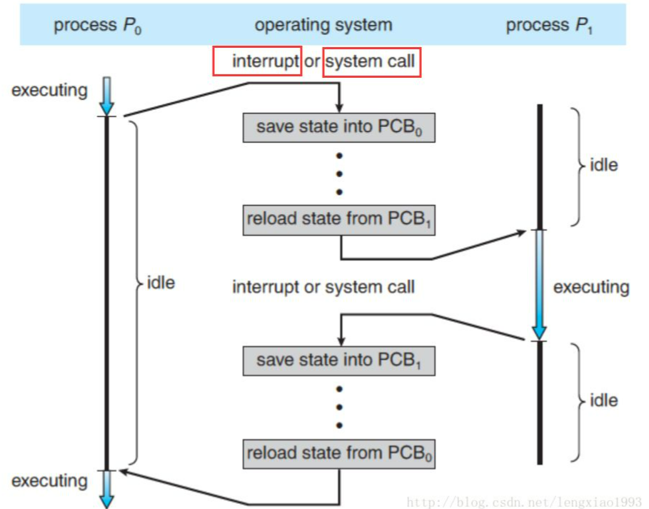
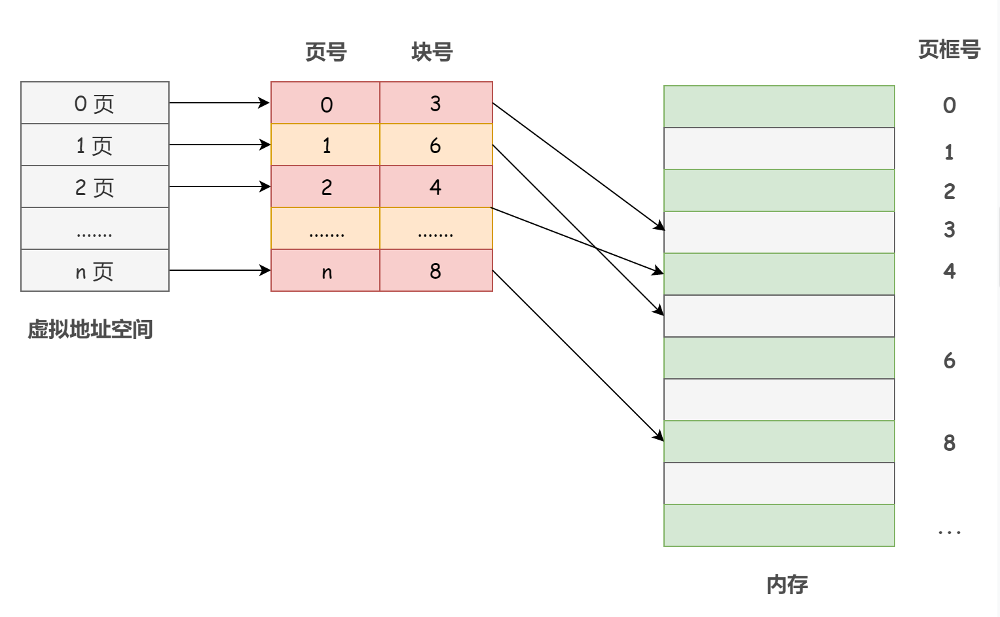

操作系统

## 操作系统

* 功能
  * 管理计算机硬件和软件资源
  * 向用户提供友好界面
* 特征
  * 并发
  * 共享
    * 互斥共享 **「同一个资源在某一时刻只允许一个进程访问」**
    * 同时共享 **「允许一个时间段内多个进程 “同时” 对系统中的某些资源进行访问」**
    * **「并发和共享作为操作系统的两大最基本特征，其实是互为存在条件的」**，没有并发性，共享性毫无意义，没有共享性，也无法实现并发
  * 虚拟
    * 空分复用技术：能够运行超过内存大小的程序
    * 时分复用技术：一个cpu能够在宏观上同时运行多个进程。
  * 异步
    * **「由于资源有限，进程的执行不是一贯到底的， 而是走走停停，以不可预知的速度向前推进」**
    * 只有拥有并发性，才能拥有异步性
* 功能
  * 进程管理
    * **「进程就是程序的一次执行过程，它是暂时的。不仅包含正在运行的程序实体，并且包括这个运行的程序中占据的所有系统资源，比如说 CPU、内存、网络资源等」**
  * 存储管理
  * 文件系统管理
  * IO管理

### 用户态和内核态

**内核就是操作系统中的一组程序模块**，作为可信软件来提供支持进程并发执行的基本功能和基本操作，**具有访问硬件设备和所有内存空间的权限**。

- **内核态**（kernel mode）：当 CPU 处于内核态时，这是操作系统管理程序（也就是内核）运行时所处的状态。运行在内核态的程序可以访问计算机的任何资源，不受限制，为所欲为，例如协调 CPU 资源，分配内存资源，提供稳定的环境供应用程序运行等。
- **用户态**（user mode）：应用程序基本都是运行在用户态的，或者说用户态就是提供应用程序运行的空间。运行在用户态的程序只能访问当前 CPU 上执行程序所在的地址空间，这样有效地防止了操作系统程序受到应用程序的侵害。

##### 内核空间

操作系统为了支持多个应用同时运行，需要保证不同进程之间相对独立（一个进程的崩溃不会影响其他的进程 ， 恶意进程不能直接读取和修改其他进程运行时的代码和数据）。 因此操作系统内核**需要拥有高于普通进程的权限**， 以此来调度和管理用户的应用程序。于是内存空间被划分为两部分，一部分为内核空间，一部分为用户空间，内核空间存储的代码和数据具有更高级别的权限。内存访问的**相关硬件**在程序执行期间会进行访问控制（ Access Control），使得用户空间的程序不能直接读写内核空间的内存。

#### 发生用户态到内核态切换的情况

* 系统调用：用户态进程主动切换到内核态的方式，用户态进程通过系统调用向操作系统申请资源完成工作，例如 fork（）就是一个创建新进程的系统调用，系统调用的机制核心使用了操作系统为用户特别开放的一个中断来实现，如Linux 的 int 80h 中断，也可以称为软中断
* 异常：当 C P U 在执行用户态的进程时，发生了一些没有预知的异常，这时当前运行进程会切换到处理此异常的内核相关进程中，也就是切换到了内核态，如缺页异常
* 中断：当 C P U 在执行用户态的进程时，外围设备完成用户请求的操作后，会向 C P U 发出相应的中断信号，这时 C P U 会暂停执行下一条即将要执行的指令，转到与中断信号对应的处理程序去执行，也就是切换到了内核态。如硬盘读写操作完成，系统会切换到硬盘读写的中断处理程序中执行后边的操作等。

### 中断机制

**中断是让操作系统内核夺回 CPU 使用权的唯一途径**。可以说，**操作系统是由中断驱动的**

发生中断的情况

- 1）程序请求操作系统服务，执行系统调用

- 2）程序运行时产生外中断事件（比如 I/O 操作完成），运行程序被中断，转向中断程序处理

- 3）在程序运行时发生内中断（异常）事件，运行程序被打断，转向异常处理程序工作

- **外中断** （也称中断，狭义上的中断）

  外中断与当前执行的指令无关， 中断信号来源于 CPU 外部。如 I/O 完成中断，表示设备输入/输出处理已经完成，CPU 能够发送下一个输入/输出请求。此外还有时钟中断、控制台中断等。

- **内中断**（也称 异常、例外）

  内中断与当前执行的指令有关， 中断信号来源于 CPU 内部。如非法操作码、地址越界、算术溢出，除数为 0 等。

1. 当一个程序正在执行的过程中， 中断（interrupt） 或 系统调用（system call） 发生可以使得 CPU 的控制权会从当前进程转移到操作系统内核。

2. 操作系统内核负责保存进程 i 在 CPU 中的上下文（程序计数器， 寄存器）到 PCBi （操作系统分配给进程的一个内存块）中。

3. 从 PCBj 取出进程 j 的CPU 上下文， 将 CPU 控制权转移给进程 j ， 开始执行进程 j 的指令。

- 中断（interrupt）  

- - CPU 微处理器有一个中断信号位， 在每个CPU时钟周期的末尾, CPU会去检测那个中断信号位是否有中断信号到达， 如果有， 则会根据中断优先级决定是否要暂停当前执行的指令， 转而去执行处理中断的指令。 （其实就是 CPU 层级的 while 轮询）

- 时钟中断( Clock Interrupt )

- - 一个硬件时钟会每隔一段（很短）的时间就产生一个中断信号发送给 CPU，CPU 在响应这个中断时， 就会去执行操作系统内核的指令， 继而将 CPU 的控制权转移给了操作系统内核， 可以由操作系统内核决定下一个要被执行的指令。

- 系统调用（system call）

- - system call 是操作系统提供给应用程序的接口。 用户通过调用 systemcall 来完成那些需要操作系统内核进行的操作， 例如硬盘， 网络接口设备的读写等。

### 系统调用的过程

1）在用户态，应用程序传递系统调用参数

2）执行陷入指令，引发一个内中断，使 CPU 进入内核态

3）在内核态，执行相应的请求，内核程序处理系统调用

4）返回应用程序

**凡是与共享资源有关的操作（比如内存分配、I/O 操作、文件管理等），都必须通过系统调用的方式向操作系统内核提出请求，由操作系统内核代为完成**。

### 操作系统线程和JAVA线程

1. #### 线程是现在用户空间下

   ​	首先就是**确实在操作系统中实现了真实的多线程**，其次就是线**程的调度只是在用户态，减少了操作系统从内核态到用户态的切换开销。**其次就是无法利用操作系统的调度器对线程进行调度，如果一个进程的某一线程发生了阻塞，操作系统将阻塞整个进程。

2. #### 线程实现在操作系统内核中

   **程序员直接使用操作系统中已经实现的线程**，而线程的创建、销毁、调度和维护，都是靠操作系统（准确的说是内核）来实现，**程序员只需要使用系统调用**，而不需要自己设计线程的调度算法和线程对CPU资源的抢占使用。

3. #### 使用用户线程加轻量级线程混合实现

   在这种混合实现下，既存在**用户线程**，也存在**轻量级进程**。用户线程还是完全建立在用户空间中，因此用户线程的创建、切换、析构等操作依然廉价，并且可以支持大规模的用户线程并发。而操作系统提供支持的轻量级进程则作为用户线程和内核线程之间的桥梁，这样可以使用内核提供的线程调度功能及处理器映射，并且用户线程的系统调用要通过轻量级进程来完成，大大降低了整个进程被完全阻塞的风险。在这种混合模式中，用户线程与轻量级进程的数量比是不定的，即为N:M的关系：

4. ### JAVA中的线程模型

   **现在的Java中线程的本质，其实就是操作系统中的线程**，Linux下是基于`pthread`库实现的**轻量级进程**，Windows下是原生的系统`Win32 API`提供系统调用从而实现**多线程**。

5. ### JAVA线程状态和操作系统线程状态的对应关系

   虚拟机中的线程状态，不反应任何操作系统线程状态

   OS线程状态：

   - `ready`：**表示线程已经被创建，正在等待系统调度分配CPU使用权。**
   - `running`：**表示线程获得了CPU使用权，正在进行运算**
   - `waiting`：**表示线程等待（或者说挂起），让出CPU资源给其他线程使用**

   JAVA线程状态：

   * new/ terminated: -
   * Timed waiting / waiting / blocked : waiting
   * runnable: ready / running

### 进程间通信

* 管道：内存中的一块缓冲区，只能进行父子进程间的通信，分为有名管道和无名管道，无名管道用完后即删除，管道只有2进制流，无统一格式，处理困难
* 消息队列：内核中一个队列，不同进程从中取消息，存消息，但是有频繁的用户态、内核态切换
* 共享内存：只有进行一次内核态切换（系统调用）为两个进程间的开辟一块共享内存
* 信号量：PV操作就是使用信号量，虽然是进程同步里面讲到的，但也属于进程通信，属于低级通信机制
* 信号：kill -9 唯一的异步通信！
* Socket：封装了TCP/IP协议族的API，通过它实现应用层通信，RPC\HTTP等

### 物理寻址

1）首先，用户程序可以寻址内存的任意一个字节，它们就可以**很容易地破坏操作系统**，从而使系统慢慢地停止运行。

2）再次，**这种寻址方式使得操作系统中同时运行两个或以上的程序几乎是不可能的**。

### 虚拟寻址

**每个进程都拥有一个自己的虚拟地址空间，并且独立于其他进程的地址空间**。

地址翻译需要 CPU 硬件和操作系统的密切合作：CPU 上的**内存管理单元**（Memory Management Unit，**MMU**）就是专门用来进行虚拟地址到物理地址的转换的，不过 MMU 需要借助存放在内存中的**页表**，而这张表的内容正是由操作系统进行管理的。

操作系统为每个进程建立了一张页表。一个进程对应一张页表，进程的每个页面对应一个页表项，每个页表项由页号和块号（页框号）组成，记录着进程页面和实际存放的内存块之间的映射关系。

### 为什么进程切换慢

每次访问内存，都需要进行虚拟地址到物理地址的转换，页表就会被频繁地访问，而页表又是存在于内存中的。所以说，访问页表（内存）次数太多导致其成为了操作系统地一个性能瓶颈。

于是，引入了转换检测缓冲区 TLB，也就是快表，其实就是一个缓存，把经常访问到的内存地址映射存在 TLB 中，因为 TLB 是在 CPU 的 MMU 中的嘛，所以访问起来非常快。

正是因为TLB的存在导致了进程切换后缓存失效，运行速度变慢，线程切换不存在虚拟地址空间的切换，所以不存在这个问题

### 内存管理

* 连续分配方式
  * 单一连续分配
  * 固定分区分配
  * 动态分区分配
* 离散分配方式
  * 分页 页表 快表
  * 分段 逻辑分段 
  * 段页 段内分页
* 内存扩充
  * 覆盖：打破了一个程序必须全部放入内存的限制
  * 交换：打破了不能并发的限制
  * 虚拟内存：基于局部性原理 请求调页 产生页中断
