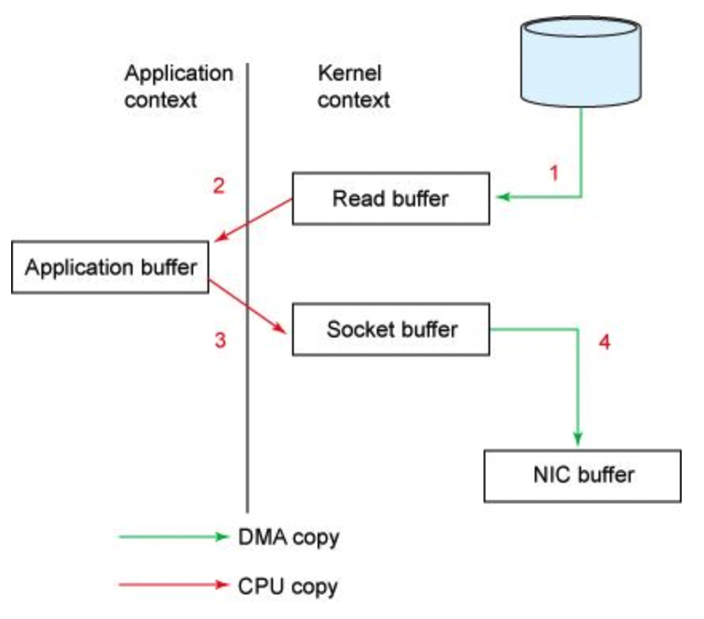

# ThreadLocal

### 核心机制

每个线程都有一个ThreadLocalMap,其中Entry的key是ThreadLocal的弱引用，value是需要存储的对应的线程私有变量，例如User。

### 四种引用

java要四种引用做什么，99%的情况下我们strong reference就是enougth的，但是在1%的 memory sensitive 场景中需要提供这种java提供这种senmatic支持，其核心目的就是为了尽量避免对象留在内存里，如果没有的话某些复杂场景的需求实现不了。

> * 软引用应用在缓存，缓存没有的话顶多就是慢一点，不会导致系统崩溃，系统内存不足的时候可以把缓存清掉。
>
> * 弱引用应用在HashMap，如果是强引用的话，只要hash表本身还存活，你HashMap有entry数组，你就肯定能引用到那个对象，因此将key作为对象的弱引用，使得对应的键值可以被回收。
>
> * 虚引用应用在内存极其敏感的场景，比如移动端应用上，主要是我们想要知道对象是何时被回收的，虚引用绑定了一个队列，对象被调用finalize方法后这个虚引用就会被加入到队列中，我们就知道这个对象是否要被回收，以便我们接下来继续去创建新对象了。
>
> 其实软弱引用也都可以绑定引用队列，只不过虚引用可以在对象被回收之前就就会被添加到引用队列中，可以在回收前采取进一步行动。
>
> 无法通过虚引用找到对象，真tm抠。

### 过期Key清理机制

* replaceStaleEntry  set过程中发现key为null，直接给他顶掉
* expungeStaleEntry get过程中发现key为null，执行探测式清理，从当前开始碰到key为null的就rehash，如果整个entry都为null了就停止
* cleanSomeSlot  每次set都会触发一次logn的启发式清理，其实也就是输入一个参数n，往前探logn次

### 内存泄露原理

* 核心：不再被使用的Entry没有在ThreadLocal中被删除
* 两种情况
  * 手动把threadlocal引用 也就是 key设为null，这样map里存的key是弱引用，会短时间产生内存泄露，不过由于使用了弱引用，会在内存不足时被垃圾回收，并且threadlocal也提供了定期的处理机制
  * 手动把value引用设置为null，这样map里对应的value还是份强引用，实际上这也不能算是内存泄漏，因为你依然可以通过threadlocal.get访问到这个对象，就好像你现在有10个引用，把对应的对象都塞到一个数组里面，你把这10个引用都设置尾null，这个数组依然引用着这些对象，所以不会回收这些对象。
* 解决办法：结束时记得remove，靠threadlocal自动清理。

# Spring事务

### 事务ACID

* Atomic: 原子性 All or Nothing
* Consistency: 一致性 ACID中的C 和 CAP中的C 很不一样 指的是事务过程中的语句可能会破坏某些constraint，但完整的事务执行后依然满足constraint 比如账本数据库要求所有债权和债务和为0，但是新加一条债务肯定是在一个记录上加100元，在一条记录上减100元，这个中间过程会破坏这个约束，但事务要求提交前后满足constraint consistency  
* Isolation: 事务之间互相隔离，未提交前互相不可见
* Durablity: guarantee 事务提交后 所有改变均已落盘

### 原子性的实现原理

* 基于数据库提供的，如果数据库不支持，那也不行，比如使用myisam引擎
* 真正执行前先写日志，回滚用undolog做撤销，崩溃了用redolog做恢复

### spring事务两种方式

* 编程式事务：稀里哗啦提交一堆sql，然后自己手动commit，如果中间有异常的话调用rollback
* 声明式事务：基于AOP使用@Transcetional注解

### spring事务实现原理

* spring事务通过SpringAOP实现，SpringAOP通过代理模式实现，代理有两种实现方法：
  * 静态代理：手写代理对象
    * 静态代理需要把代理类编译成对应 class 文件，动态代理是在运行时动态生成字节码，加载到 JVM 里
    * 静态代理中，接口一旦新增加方法，目标对象和代理对象都要进行修改，动态代理压根就不需要创建代理类。
  * 动态代理：
    * JDK动态代理 和 CGLIB动态代理
      * JDK实现接口来创建代理对象，因为实现类继承了Proxy父类，所以只能通过接口来实现；CGLIB 动态代理是通过生成子类来拦截被代理类的方法调用。

### spring事务管理核心类

* PlatformTransactionManager接口:
* JDBC JPA Hibernate都实现了具体的事务管理器，主要是实现获取事务状态，提交事务，回滚三个方法。

### Spring事务属性

* 隔离级别
  * Default：后端数据库默认级别
  * READ_UNCOMMITTED： 读未提交 会出现脏读
  * READ_COMMITTED: 读已提交 会出现不可重复读
  * REPEATABLE_READ： 可重复读 会出现幻读
  * SERIALIZABLE： 完全串行执行。
* 事务传播 解决业务层方法互相调用时与事务相关的问题
  * Required（默认）: 外部方法没有开启事务，内部开启独立事务；外部方法开启事务，内部加入到同一事务。
  * Requires_New: 内部方法开启单独事务
  * Nested：外部有事务的话开启嵌套事务，父事务提交时子事务才会提交，子事务可以独立于父事务进行回滚，类似于游戏中途进行存档，可以回滚到存档点。
  * Mandatory: 当前不存在事务的话抛出异常。
* 回滚规则：遇到Runtime Exception 或者 Error 时回滚，一般遇到受检查异常时不回滚。
* 是否只读：减少事务提交次数（默认autocommit每一条sql都是一次事务），保证读一致性，防止读与读之间更改了数据。
* 事务超时：超时后自动回滚事务

### Spring事务失效场景

* 事务方法不是public，因为只能代理public方法
* 方法是static 或者 final，因为代理类要重写该方法
* 自己调用this.事务方法会失效，因为this没有被spring容器管理，autowired的才会被管理，需要创建一个内部service然后注入进去
* 多线程调用，创建的是新的线程，新线程里执行sql，数据库连接都不一样，何谈事务
* 事务传播机制
* 数据库引擎没支持事务
* 自己捕获了异常，或者手动抛出了Exception，自定义回滚需要遇上的异常
* 内部嵌套事务抛出了异常，导致外部事务也要回滚

# Spring多线程

### 核心类和注解

* ThreadPoolTaskExecutor 普通任务 @Async
* ThreadPoolTaskScheduler 定时任务 @Scheduler

### 线程池核心参数

* 核心线程数
* 阻塞队列 满了往队列塞
* 最大线程数 队列满了开临时线程
* 过期时间
* 线程工厂 给线程起名字之类的 
* 拒绝策略  最大线程后的过期策略

# Redis

### 数据类型

* 使用Bitmap计算DAU日活跃用户，使用HyperLogLog计算UV，只需要使用12K空间就可以近似计算2^{64}次方个不同元素。

### 旁路缓存模式 Cache Aside Pattern

* 写 先更新数据库再删除缓存
* 读 先查cache，cache查不到再查数据库，返回数据并且然后把数据放到cache中

> 先删除缓存后更新数据库会有什么问题： 
>
> 删完缓存中间有人读了一手，把缓存又给更新了，导致缓存和数据库的不一致
>
> 先更新数据库再删除缓存有什么问题：
>
> 别人读数据库，你更新数据库、删除缓存，别人写缓存，不一致了，相当于你的更新被插入在了一条读之间，发生概率极小。
>
> 分布式场景下 主从延迟导致的问题：
>
> 你更新数据库 删除缓存 别人从库中查到旧值 在更新缓存
>
> 完整解决：延迟双删，先休眠一会再删除缓存或者在消息队列中生成一条延时删除消息，由消费者延时删除缓存，时效性要求低的场景下也可以采用定时更新的方案。

### 读写穿透模式 Read/Write Through Pattern

* 先写缓存，再写数据库，redis压根没提供这种写db的功能

### 异步缓存写入 Write Behind Pattern

* 更新完缓存后不直接更新db，而是异步批量进行更新，实际开发中很少，但比如消息队列异步写入磁盘、innodb的buffer pool都用到了这种机制

# KafKa

### 为什么选择KafKa

* 极致的性能，设计中大量使用了批处理和异步的思想
* 生态兼容
* 缓冲和削峰：上游突发流量，消息暂存在KafKa中起到缓冲左右
* 解耦和扩展：消息队列作为接口，解耦重要业务流程
* 冗余：多个消费者组可以订阅一个topic
* 健壮性：消费者线程暂时挂掉也没事
* 异步通信：不想立即处理消息

### Topic Partition Consumer 

* 一个topic 多个 partition 实现高并发
* 一个topic  绑定到一个 consumer group上 ||  一个Consumer group 可以订阅多个topic
* 一个partition 可以被不同Consumer Group的consumer 处理 （用于订阅模式） || 一个consumer 能消费多个partition 
* 同一个Consumer Group不会重复消费消息，不同消费者消费消息互不影响
* 建议consumer 数量 等于 partition 数量，即完全的一对一关系
* 如果某个consumer 挂了，需要Rebalance
* offset是消息在分区中的唯一标识，用来【分区内】保证消息的顺序性

### KafKa消息丢失

* 消息传递语义

  * At Least Once: 至少一次，可能重复消费
  * At Most Once：最多一次，可能丢失消息
  * Exactly Once：精确不丢失不重复处理一次
* 消息传递的三个过程

  * 生产者发送消息给Broker
    * Broker配置为不发送ack，生产者不知道消息是否发送成功
    * Broker配置为保证leader不丢，如果此时leader挂了选了一个没有ack的新leader，消息丢失
    * Broker配置为保证所有replica接受到消息，会导致网络堵塞，超过生产者设定的延时，消息重复发送
    * 生产者端可以自己配置对应的重试次数或者异步回调函数

  * Broker消息同步和持久化
  * Broker将消息传递给消费者
    * 先commit offset，再处理消息，如果commit完消费者挂了，消息丢失
    * 先处理消息，再commit offset，如果处理完还没commit消费者挂了，重复消费

### 高性能

* 采用了顺序写来优化磁盘性能

* 使用mmap 和 sendfile命令，一个将文件映射到用户进程地址空间，一个将文件发送给socket，减少了两次message在内存的移动，也减少了两次状态切换，对于支持gather操作的网卡还可以直接让网卡读内核缓冲区，不再需要从socket缓冲区读取，

  

* 基于Reactor网络模型实现io多路复用，Acceptor线程处理新的连接，Processor接受和读取，Handler进行业务处理

* 消息批量传输和压缩消息，同时broker不解压消息，而是直接写入压缩消息，消息解压推迟到consumer进行

* 多个partition实现分区并发 partition过多会导致文件数过多、缓存使用过多、可用性降低。

* 高效的数据结构，每个partition文件分为多个segment，每个segment包含多个索引和数据文件，通过二分法找segment，再二分找索引文件，最后拿到数据文件

* 无锁轻量级offset，内存

### Zookeeper

* Broker、Partition、Topic等元数据信息存储在Zookeeper上
* Controller（每个Broker上线时都会想当Controller，内部也是通过消息队列和zk通信）
  * Leader选举
  * 处理Broker节点上线下线
  * Topic分区分配
  * 管理partition状态和replicas状态

# 项目难点 

### 站内消息系统的设计

* 消息类别
  * 系统推送
  * 回复 点赞等行为产生的提醒
  * 用户间私信
* Kafka 生产者消费者模型 实现异步消息推送机制
  * 比如用户发送消息通知，由生产者对应的发送者、接受者、消息内容封装成一个事件对象插入到消息队列中，消费者线程异步监听队列内容的变化，取出对应的事件，比如点赞、关注、评论等，进行相应的处理。

​	